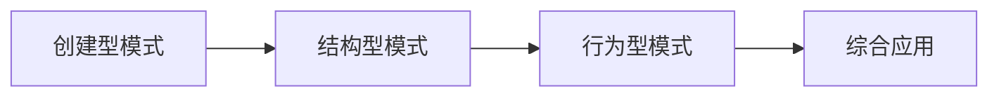

# 🎨 设计模式实战 - Design Patterns

> **23种经典设计模式的Java实现与企业级应用实践**

[](https://www.java.com)
[](https://github.com/xingshaocheng/architect-awesome)
[](LICENSE)

---

## 📚 项目概述

本模块提供了**23种经典设计模式**的完整Java实现，结合企业级开发场景，深入讲解每种模式的:
- **核心原理** - 设计思想与解决问题
- **代码实现** - 规范化的Java代码
- **应用场景** - 实际项目中的运用
- **面试要点** - 常见面试题解析
- **源码分析** - 知名框架中的应用

---

## 🏗️ 模块结构

```
DesignPattern/
├── 🧱 创建型模式 (Creational Patterns)
│   ├── 🔵 singleton/         # 单例模式
│   ├── 🏭 factory/           # 工厂模式  
│   ├── 🏗️ abstractfactory/   # 抽象工厂模式
│   ├── 👷 builder/           # 建造者模式
│   └── 🐑 prototype/         # 原型模式
├── 🔧 结构型模式 (Structural Patterns)
│   ├── 🔌 adapter/           # 适配器模式
│   ├── 🌉 bridge/            # 桥接模式
│   ├── 🎄 composite/         # 组合模式
│   ├── 🎨 decorator/         # 装饰器模式
│   ├── 🏛️ facade/            # 外观模式
│   ├── 🪶 flyweight/         # 享元模式
│   └── 👥 proxy/             # 代理模式
└── 🎭 行为型模式 (Behavioral Patterns)
    ├── ⛓️ chainofresponsibility/ # 责任链模式
    ├── 📝 command/           # 命令模式
    ├── 🗣️ interpreter/        # 解释器模式
    ├── 🔄 iterator/          # 迭代器模式
    ├── 🎛️ mediator/          # 中介者模式
    ├── 💾 memento/           # 备忘录模式
    ├── 👁️ observer/          # 观察者模式
    ├── 🔄 state/             # 状态模式
    ├── 🎯 strategy/          # 策略模式
    └── 📋 template/          # 模板方法模式
```

---

## 🌟 核心亮点

### ⚡ 创新实践方案
- **企业级实现** - 结合Spring框架的最佳实践
- **现代化代码** - Java 21新特性应用  
- **性能优化** - 线程安全与高并发考虑
- **单元测试** - 完整的测试用例覆盖

### 📊 学习价值
- **理论结合实践** - 不仅知其然，更知其所以然
- **面试必备** - 涵盖所有高频面试题
- **项目实战** - 真实业务场景应用
- **源码解读** - Spring/MyBatis等框架应用分析

---

## 🎯 重点模式详解

### 🔵 单例模式 (Singleton)
- **饿汉式** - 类加载时初始化
- **懒汉式** - 延迟加载实现  
- **双重检查锁** - 线程安全优化
- **枚举实现** - 最优雅的方案
- **静态内部类** - 推荐的最佳实践

```java
// 静态内部类实现 - 推荐方案
public class InnerClassSingleton {
    private static class SingletonHolder {
        private static final InnerClassSingleton INSTANCE = new InnerClassSingleton();
    }
    
    public static InnerClassSingleton getInstance() {
        return SingletonHolder.INSTANCE;
    }
}
```

### 🎯 策略模式 (Strategy) 
- **经典实现** - 计算器、支付策略
- **企业级方案** - 缓存策略、认证策略
- **Spring集成** - 配合依赖注入
- **条件选择器** - 动态策略切换

```java
// 策略模式在支付系统中的应用
@Component
public class PaymentProcessor {
    private final Map<String, PaymentStrategy> strategies;
    
    public PaymentResult process(PaymentRequest request) {
        PaymentStrategy strategy = strategies.get(request.getPaymentType());
        return strategy.pay(request);
    }
}
```

---

## 📖 学习路径

### 🎯 初学者路径


### 🚀 进阶路径


---

## 💡 设计原则

### SOLID原则
- **S** - 单一职责原则 (SRP)
- **O** - 开闭原则 (OCP) 
- **L** - 里氏替换原则 (LSP)
- **I** - 接口隔离原则 (ISP)
- **D** - 依赖倒置原则 (DIP)

### 其他重要原则
- **迪米特法则** - 最少知识原则
- **合成复用原则** - 优先使用组合
- **里氏替换原则** - 子类可替换父类

---

## 🛠️ 快速开始

### 环境要求
```bash
- JDK 21+
- Maven 3.9+
- IntelliJ IDEA (推荐)
```

### 运行示例
```bash
# 1. 进入模块目录
cd DesignPattern

# 2. 编译项目
mvn clean compile

# 3. 运行单例模式示例
mvn exec:java -Dexec.mainClass="com.architecture.designpattern.singleton.SingletonExample"

# 4. 运行策略模式示例  
mvn exec:java -Dexec.mainClass="com.architecture.designpattern.strategy.ClassicExamples"
```

---

## 📊 企业级应用案例

### 🏪 电商系统中的模式应用

#### 🛒 订单处理 - 策略模式
- **促销策略** - 满减、折扣、买赠
- **支付策略** - 支付宝、微信、银联
- **物流策略** - 顺丰、圆通、申通

#### 🔐 权限控制 - 装饰器模式
- **基础权限** - 登录验证
- **角色权限** - 管理员、普通用户
- **功能权限** - 读取、写入、删除

#### 📊 数据处理 - 责任链模式
- **数据验证** - 格式检查、业务校验
- **数据转换** - 编码转换、格式标准化
- **数据存储** - 缓存、数据库、搜索引擎

---

## 🎓 面试题库

### 高频面试题
1. **单例模式的线程安全实现方式**
2. **策略模式与状态模式的区别**
3. **装饰器模式与代理模式的异同**
4. **工厂模式的三种实现方式**
5. **观察者模式在Spring中的应用**

### 深度思考题
1. **如何选择合适的设计模式？**
2. **设计模式的过度使用问题**
3. **函数式编程对设计模式的影响**

---

## 📚 学习资源

### 推荐书籍
- 📖 《设计模式：可复用面向对象软件的基础》- GoF四人组
- 📖 《Head First设计模式》- 生动易懂的入门书
- 📖 《重构：改善既有代码的设计》- Martin Fowler

### 在线资源
- 🌐 [Design Patterns in Java](https://java-design-patterns.com/)
- 🎥 [设计模式视频教程](https://www.bilibili.com/)
- 📝 [设计模式博客系列](https://blog.csdn.net/)

---

## 🤝 贡献指南

欢迎提交代码改进和新的模式实现！

### 贡献方式
1. **Fork项目** - 创建你的特性分支
2. **添加实现** - 遵循项目代码规范
3. **编写测试** - 确保代码质量
4. **提交PR** - 详细描述变更内容

---

## 📄 许可证

本项目采用 [MIT License](LICENSE) 开源协议。

---

**🎯 目标：成为最实用的Java设计模式学习资源！**

*最后更新: 2026年1月11日*