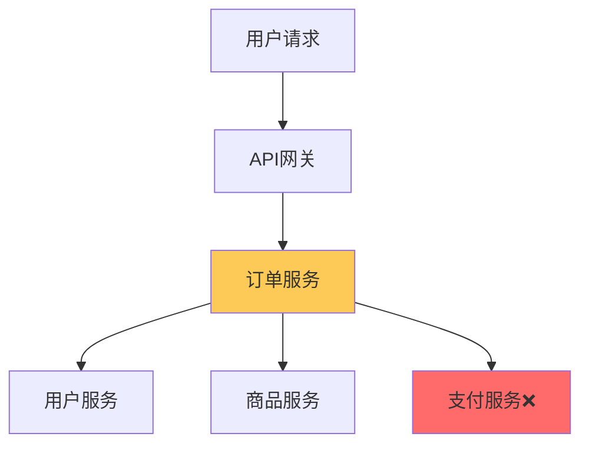
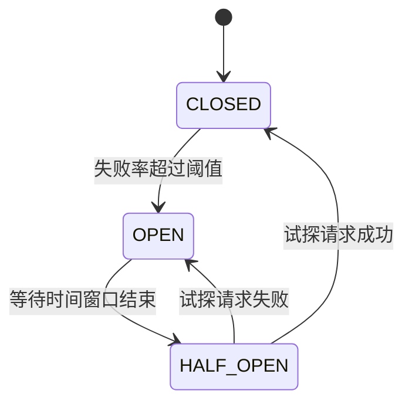
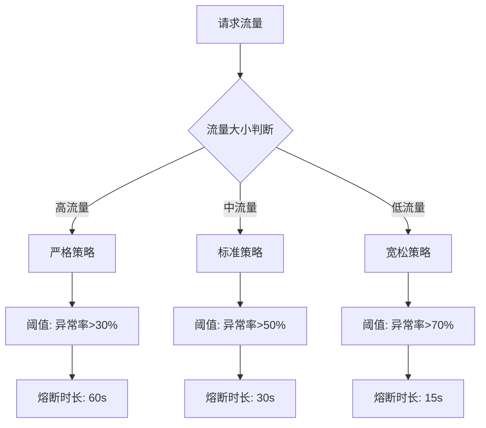
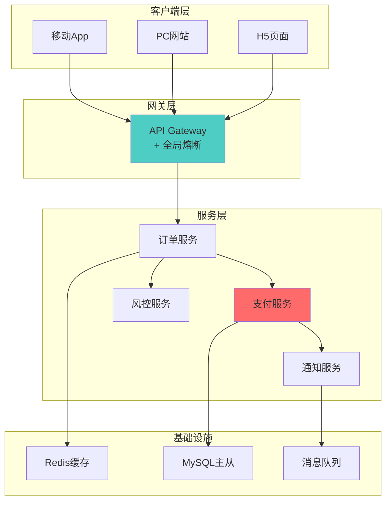

# 🛡️ 微服务熔断设计完整指南

> **核心理念**：微服务熔断是分布式系统中的重要容错机制，通过及时切断故障服务来保护整个系统的稳定性。

## 📖 目录
- [🎯 熔断机制基础](#-熔断机制基础)
- [🔧 主流熔断框架](#-主流熔断框架)  
- [📊 熔断策略设计](#-熔断策略设计)
- [🔄 服务恢复机制](#-服务恢复机制)
- [💡 优化处理方案](#-优化处理方案)
- [🚀 实战案例](#-实战案例)

---

## 🎯 熔断机制基础

### 🌟 熔断是干什么的？解决什么问题？

#### 📋 核心作用
熔断器（Circuit Breaker）是微服务架构中的**自我保护机制**，主要作用包括：

1. **故障隔离** - 防止单个服务故障传播到整个系统
2. **资源保护** - 避免持续调用失败的服务浪费资源
3. **快速失败** - 及时返回错误，提升用户体验
4. **系统稳定** - 保护上游服务不被拖垮

#### 🔍 解决的核心问题



**问题场景分析**：
- ❌ **雪崩效应** - 支付服务故障导致订单服务阻塞，进而影响整个电商系统
- ❌ **资源耗尽** - 大量请求堆积在故障服务，消耗连接池、线程池
- ❌ **响应超时** - 用户体验恶化，系统吞吐量急剧下降
- ❌ **级联失败** - 故障在微服务之间传播扩散

#### 💡 熔断vs降级vs限流对比

| 机制 | 触发条件 | 作用范围 | 处理方式 | 使用场景 |
|------|----------|----------|----------|----------|
| **熔断** | 故障率/超时率超阈值 | 服务间调用 | 快速失败/fallback | 依赖服务不可用 |
| **降级** | 系统压力大/人工触发 | 业务功能 | 简化逻辑/缓存数据 | 保核心业务 |
| **限流** | 请求量超过阈值 | 入口流量 | 拒绝/延迟处理 | 系统容量保护 |

---

## 🔧 主流熔断框架

### 🌟 你用过哪些熔断框架？他们是如何处理服务熔断的？

#### 1️⃣ **Spring Cloud Netflix Hystrix** (已维护模式)

**架构设计**：
```java
@Component
public class PaymentService {
    
    @HystrixCommand(
        fallbackMethod = "paymentFallback",
        commandProperties = {
            @HystrixProperty(name = "circuitBreaker.enabled", value = "true"),
            @HystrixProperty(name = "circuitBreaker.requestVolumeThreshold", value = "10"),
            @HystrixProperty(name = "circuitBreaker.sleepWindowInMilliseconds", value = "10000"),
            @HystrixProperty(name = "circuitBreaker.errorThresholdPercentage", value = "50")
        }
    )
    public String processPayment(String orderId) {
        // 调用支付服务
        return paymentClient.pay(orderId);
    }
    
    public String paymentFallback(String orderId) {
        return "支付服务暂时不可用，请稍后重试";
    }
}
```

**Hystrix三大状态机**：


**核心特性**：
- ✅ **隔离策略** - 线程池/信号量隔离
- ✅ **实时监控** - Hystrix Dashboard
- ✅ **配置动态** - Archaius配置中心
- ❌ **停止维护** - Netflix已不再更新

#### 2️⃣ **Spring Cloud Gateway + Resilience4j** (推荐)

**现代化设计**：
```java
@Configuration
public class CircuitBreakerConfig {
    
    @Bean
    public CircuitBreaker paymentCircuitBreaker() {
        return CircuitBreaker.of("payment", CircuitBreakerConfig.custom()
            .failureRateThreshold(50)                    // 失败率阈值50%
            .waitDurationInOpenState(Duration.ofSeconds(30))  // 熔断等待30s
            .slidingWindowSize(10)                       // 滑动窗口10个请求
            .minimumNumberOfCalls(5)                     // 最少5个请求
            .slowCallRateThreshold(50)                   // 慢调用率阈值50%
            .slowCallDurationThreshold(Duration.ofSeconds(2)) // 慢调用阈值2s
            .build());
    }
}

@Service
public class PaymentService {
    
    private final CircuitBreaker circuitBreaker;
    
    public String processPayment(String orderId) {
        Supplier<String> decoratedSupplier = CircuitBreaker
            .decorateSupplier(circuitBreaker, () -> {
                return paymentClient.pay(orderId);
            });
            
        return Try.ofSupplier(decoratedSupplier)
            .recover(throwable -> "支付服务暂时不可用")
            .get();
    }
}
```

#### 3️⃣ **Alibaba Sentinel** (国产优秀)

**规则配置**：
```java
@Service
public class PaymentService {
    
    @SentinelResource(
        value = "payment",
        fallback = "paymentFallback",
        blockHandler = "paymentBlockHandler"
    )
    public String processPayment(String orderId) {
        return paymentClient.pay(orderId);
    }
    
    // 降级处理
    public String paymentFallback(String orderId, Throwable ex) {
        return "支付服务异常，已切换到缓存模式";
    }
    
    // 熔断处理  
    public String paymentBlockHandler(String orderId, BlockException ex) {
        return "支付服务熔断中，请稍后重试";
    }
}
```

**动态规则配置**：
```java
@PostConstruct
public void initCircuitBreakerRules() {
    List<DegradeRule> rules = new ArrayList<>();
    DegradeRule rule = new DegradeRule();
    rule.setResource("payment");
    rule.setGrade(CircuitBreakerStrategy.ERROR_RATIO.getType());
    rule.setCount(0.5);              // 异常比例阈值50%
    rule.setTimeWindow(30);          // 熔断时长30s
    rule.setMinRequestAmount(5);     // 最小请求数
    rule.setStatIntervalMs(30000);   // 统计时长30s
    
    rules.add(rule);
    DegradeRuleManager.loadRules(rules);
}
```

#### 4️⃣ **框架对比分析**

| 特性 | Hystrix | Resilience4j | Sentinel |
|------|---------|--------------|----------|
| **维护状态** | ❌ 停止维护 | ✅ 活跃开发 | ✅ 阿里维护 |
| **性能** | 中等 | 🚀 高性能 | 🚀 高性能 |
| **功能丰富度** | ⭐⭐⭐⭐ | ⭐⭐⭐⭐⭐ | ⭐⭐⭐⭐⭐ |
| **学习成本** | 中等 | 较低 | 中等 |
| **监控面板** | Dashboard | Micrometer | 控制台 |
| **动态配置** | 支持 | 支持 | ✅ 强大 |
| **社区生态** | Spring Cloud | Spring生态 | 阿里生态 |

---

## 📊 熔断策略设计

### 🌟 你们项目中是如何确定服务是否需要熔断的？

#### 🎯 熔断策略矩阵



#### 📋 策略制定原则

**1. 服务重要性分级**
```yaml
# 核心服务 - 严格策略
core-services:
  payment-service:
    failure-rate-threshold: 30%
    slow-call-rate-threshold: 40%
    wait-duration: 60s
    sliding-window-size: 20
    
  user-service:
    failure-rate-threshold: 25%
    slow-call-rate-threshold: 35%
    wait-duration: 45s
    sliding-window-size: 20

# 一般服务 - 标准策略  
normal-services:
  notification-service:
    failure-rate-threshold: 50%
    slow-call-rate-threshold: 50%
    wait-duration: 30s
    sliding-window-size: 10

# 可选服务 - 宽松策略
optional-services:
  analytics-service:
    failure-rate-threshold: 70%
    slow-call-rate-threshold: 60%
    wait-duration: 15s
    sliding-window-size: 5
```

**2. 基于SLA的动态阈值**
```java
@Component
public class DynamicThresholdCalculator {
    
    public CircuitBreakerConfig calculateThreshold(String serviceName) {
        ServiceSLA sla = slaRepository.findByServiceName(serviceName);
        double availabilityTarget = sla.getAvailabilityTarget(); // 99.9%
        
        // 根据SLA计算合理的熔断阈值
        int failureThreshold = (int) ((1 - availabilityTarget) * 100 * 2);
        
        return CircuitBreakerConfig.custom()
            .failureRateThreshold(failureThreshold)
            .waitDurationInOpenState(Duration.ofSeconds(30))
            .build();
    }
}
```

**3. 业务场景适配**
```java
// 电商场景示例
@Configuration
public class ECommerceCircuitBreakerConfig {
    
    // 大促期间 - 更严格的策略
    @ConditionalOnProperty(value = "business.promotion", havingValue = "true")
    @Bean
    public CircuitBreakerConfig promotionConfig() {
        return CircuitBreakerConfig.custom()
            .failureRateThreshold(20)      // 降低失败阈值
            .waitDurationInOpenState(Duration.ofSeconds(10))  // 快速恢复
            .build();
    }
    
    // 正常期间 - 标准策略
    @ConditionalOnProperty(value = "business.promotion", havingValue = "false") 
    @Bean
    public CircuitBreakerConfig normalConfig() {
        return CircuitBreakerConfig.custom()
            .failureRateThreshold(50)
            .waitDurationInOpenState(Duration.ofSeconds(30))
            .build();
    }
}
```

#### 🔍 监控指标体系

**核心监控指标**：
```java
@Component
public class CircuitBreakerMetrics {
    
    private final MeterRegistry meterRegistry;
    
    // 1. 请求成功率
    @EventListener
    public void onCircuitBreakerEvent(CircuitBreakerEvent event) {
        Timer.Sample sample = Timer.start(meterRegistry);
        
        Counter.builder("circuit.breaker.calls")
            .tag("name", event.getCircuitBreakerName())
            .tag("state", event.getEventType().toString())
            .register(meterRegistry)
            .increment();
    }
    
    // 2. 响应时间分布
    public void recordCallDuration(String serviceName, Duration duration) {
        Timer.builder("service.call.duration")
            .tag("service", serviceName)
            .register(meterRegistry)
            .record(duration);
    }
    
    // 3. 熔断器状态变化
    public void recordStateChange(String serviceName, State from, State to) {
        Gauge.builder("circuit.breaker.state")
            .tag("service", serviceName)
            .register(meterRegistry, () -> to.ordinal());
    }
}
```

---

## 🔄 服务恢复机制

### 🌟 服务熔断后要怎么恢复服务？

#### 🔧 渐进式恢复策略

**1. 半开状态探测**
```java
@Component
public class ProgressiveRecoveryManager {
    
    private final CircuitBreaker circuitBreaker;
    private final LoadBalancer loadBalancer;
    
    // 渐进式流量恢复
    public void configureProgressiveRecovery() {
        circuitBreaker.getEventPublisher()
            .onStateTransition(event -> {
                if (event.getStateTransition() == OPEN_TO_HALF_OPEN) {
                    // 进入半开状态，开始渐进式恢复
                    startProgressiveRecovery(event.getCircuitBreakerName());
                }
            });
    }
    
    private void startProgressiveRecovery(String serviceName) {
        // 第一阶段：5%流量
        scheduleRecoveryPhase(serviceName, 5, Duration.ofSeconds(30));
        
        // 第二阶段：20%流量  
        scheduleRecoveryPhase(serviceName, 20, Duration.ofSeconds(60));
        
        // 第三阶段：50%流量
        scheduleRecoveryPhase(serviceName, 50, Duration.ofSeconds(90));
        
        // 第四阶段：100%流量
        scheduleRecoveryPhase(serviceName, 100, Duration.ofSeconds(120));
    }
    
    private void scheduleRecoveryPhase(String serviceName, int trafficPercentage, Duration delay) {
        CompletableFuture.delayedExecutor(delay.toMillis(), TimeUnit.MILLISECONDS)
            .execute(() -> {
                loadBalancer.setTrafficWeight(serviceName, trafficPercentage);
                log.info("服务{}恢复到{}%流量", serviceName, trafficPercentage);
            });
    }
}
```

**2. 健康检查机制**
```java
@Component
public class ServiceHealthChecker {
    
    @Scheduled(fixedDelay = 10000) // 每10秒检查一次
    public void performHealthCheck() {
        circuitBreakerRegistry.getAllCircuitBreakers()
            .forEach(cb -> {
                if (cb.getState() == CircuitBreaker.State.OPEN) {
                    checkServiceHealth(cb.getName());
                }
            });
    }
    
    private void checkServiceHealth(String serviceName) {
        try {
            // 执行轻量级健康检查
            HealthCheckResponse response = healthClient.ping(serviceName);
            
            if (response.isHealthy()) {
                // 服务恢复，尝试转为半开状态
                CircuitBreaker cb = circuitBreakerRegistry.circuitBreaker(serviceName);
                cb.transitionToHalfOpenState();
                log.info("检测到服务{}恢复，转为半开状态", serviceName);
            }
            
        } catch (Exception e) {
            log.debug("服务{}健康检查失败: {}", serviceName, e.getMessage());
        }
    }
}
```

**3. 智能恢复算法**
```java
@Component
public class IntelligentRecoveryManager {
    
    // 基于历史数据的智能恢复
    public Duration calculateOptimalRecoveryTime(String serviceName) {
        ServiceMetrics metrics = metricsRepository.findByServiceName(serviceName);
        
        // 分析历史恢复时间
        List<Long> historicalRecoveryTimes = metrics.getRecoveryTimes();
        double avgRecoveryTime = historicalRecoveryTimes.stream()
            .mapToLong(Long::longValue)
            .average()
            .orElse(30000); // 默认30秒
            
        // 考虑当前系统负载
        double systemLoad = systemMetrics.getCurrentLoad();
        double adjustmentFactor = systemLoad > 0.8 ? 1.5 : 1.0;
        
        long optimalTime = (long) (avgRecoveryTime * adjustmentFactor);
        return Duration.ofMillis(optimalTime);
    }
    
    // 基于错误类型的差异化恢复
    public RecoveryStrategy selectRecoveryStrategy(Exception lastException) {
        if (lastException instanceof TimeoutException) {
            return RecoveryStrategy.GRADUAL_TRAFFIC_INCREASE;
        } else if (lastException instanceof ConnectionException) {
            return RecoveryStrategy.CONNECTION_POOL_RESET;
        } else {
            return RecoveryStrategy.STANDARD_RECOVERY;
        }
    }
}
```

#### 📊 恢复效果评估
```java
@Component
public class RecoveryEffectivenessAnalyzer {
    
    public void analyzeRecoveryEffectiveness(String serviceName) {
        RecoveryMetrics metrics = collectRecoveryMetrics(serviceName);
        
        // 恢复成功率
        double recoverySuccessRate = metrics.getSuccessfulRecoveries() / 
                                   (double) metrics.getTotalRecoveryAttempts();
        
        // 平均恢复时间
        Duration avgRecoveryTime = metrics.getAverageRecoveryTime();
        
        // 恢复后稳定性
        double postRecoveryStability = metrics.getPostRecoveryStabilityScore();
        
        // 生成恢复报告
        RecoveryReport report = RecoveryReport.builder()
            .serviceName(serviceName)
            .recoverySuccessRate(recoverySuccessRate)
            .averageRecoveryTime(avgRecoveryTime)
            .stabilityScore(postRecoveryStability)
            .recommendations(generateRecommendations(metrics))
            .build();
            
        reportService.generateRecoveryReport(report);
    }
}
```

---

## 💡 优化处理方案

### 🌟 每次熔断都会丢失客户请求，有没有更好的处理方法？

#### 🛡️ 多层降级策略

**1. 缓存降级**
```java
@Service
public class PaymentServiceWithCache {
    
    @Cacheable(value = "payment-cache", key = "#orderId")
    @HystrixCommand(fallbackMethod = "paymentCacheFallback")
    public PaymentResult processPayment(String orderId) {
        return paymentClient.pay(orderId);
    }
    
    // 第一层降级：返回缓存数据
    public PaymentResult paymentCacheFallback(String orderId) {
        PaymentResult cached = cacheManager.getFromCache(orderId);
        if (cached != null) {
            log.info("使用缓存数据处理支付请求: {}", orderId);
            return cached.markAsCached();
        }
        return paymentAsyncFallback(orderId);
    }
    
    // 第二层降级：异步处理
    public PaymentResult paymentAsyncFallback(String orderId) {
        // 将请求放入队列，异步处理
        paymentQueue.offer(PaymentRequest.builder()
            .orderId(orderId)
            .timestamp(System.currentTimeMillis())
            .build());
            
        return PaymentResult.builder()
            .orderId(orderId)
            .status(PaymentStatus.PROCESSING)
            .message("支付请求已提交，稍后处理")
            .build();
    }
}
```

**2. 本地兜底服务**
```java
@Component
public class LocalFallbackService {
    
    // 本地规则引擎
    public PaymentDecision makeLocalDecision(PaymentRequest request) {
        // 基于历史数据和规则进行本地决策
        UserProfile user = localUserCache.get(request.getUserId());
        
        if (user.getCreditScore() > 700 && request.getAmount().compareTo(user.getLimit()) < 0) {
            return PaymentDecision.approve(request)
                .markAsLocalDecision()
                .setConfidence(0.8);
        }
        
        return PaymentDecision.decline(request)
            .setReason("本地风控规则拒绝")
            .setConfidence(0.9);
    }
    
    // 离线数据同步
    @Scheduled(fixedRate = 60000)
    public void syncOfflineData() {
        if (isServiceAvailable()) {
            List<PaymentRequest> pendingRequests = pendingRequestRepository.findAll();
            pendingRequests.forEach(this::processWithRemoteService);
        }
    }
}
```

**3. 消息队列缓冲**
```java
@Component
public class MessageBufferService {
    
    @RabbitListener(queues = "payment.buffer.queue")
    public void processBufferedPayment(PaymentMessage message) {
        try {
            // 尝试处理缓冲的支付请求
            PaymentResult result = paymentService.processPayment(message.getOrderId());
            
            // 通知客户处理结果
            notificationService.notifyPaymentResult(message.getUserId(), result);
            
        } catch (Exception e) {
            // 重新放入队列延迟处理
            retryService.retryLater(message);
        }
    }
    
    // 智能缓冲策略
    public void bufferRequest(PaymentRequest request) {
        // 根据用户等级决定缓冲策略
        UserTier tier = userService.getUserTier(request.getUserId());
        
        switch (tier) {
            case VIP:
                // VIP用户优先处理
                vipPaymentQueue.offer(request);
                break;
            case PREMIUM:
                // 高级用户快速队列
                premiumPaymentQueue.offer(request);
                break;
            default:
                // 普通用户标准队列
                standardPaymentQueue.offer(request);
        }
    }
}
```

#### 🔄 请求重试机制

**1. 智能重试策略**
```java
@Component
public class IntelligentRetryService {
    
    @Retryable(
        value = {ConnectException.class, TimeoutException.class},
        maxAttempts = 3,
        backoff = @Backoff(
            delay = 1000,
            multiplier = 2,
            maxDelay = 10000
        )
    )
    public PaymentResult processPaymentWithRetry(PaymentRequest request) {
        // 根据异常类型选择不同的重试策略
        RetryContext context = RetryContextHolder.getContext();
        
        if (context.getRetryCount() > 0) {
            adjustRetryStrategy(context.getLastThrowable());
        }
        
        return paymentClient.processPayment(request);
    }
    
    private void adjustRetryStrategy(Throwable lastException) {
        if (lastException instanceof TimeoutException) {
            // 超时异常，增加请求超时时间
            adjustTimeout(Duration.ofSeconds(5));
        } else if (lastException instanceof ConnectException) {
            // 连接异常，切换到备用节点
            switchToBackupNode();
        }
    }
    
    @Recover
    public PaymentResult recoverFromPaymentFailure(Exception e, PaymentRequest request) {
        log.error("支付请求最终失败，启动降级处理: {}", request.getOrderId(), e);
        return fallbackService.processPaymentFallback(request);
    }
}
```

**2. 多数据中心容灾**
```java
@Component
public class MultiRegionFallbackService {
    
    private final List<PaymentServiceClient> regionalClients;
    
    public PaymentResult processPaymentWithRegionalFallback(PaymentRequest request) {
        for (PaymentServiceClient client : regionalClients) {
            try {
                CircuitBreaker cb = circuitBreakerRegistry.circuitBreaker(client.getRegion());
                
                if (cb.getState() != CircuitBreaker.State.OPEN) {
                    return client.processPayment(request);
                }
                
            } catch (Exception e) {
                log.warn("区域{}支付失败，尝试下一个区域", client.getRegion());
                continue;
            }
        }
        
        // 所有区域都失败，启动本地处理
        return localFallbackService.processLocally(request);
    }
}
```

#### 📱 用户体验优化

**1. 渐进式用户体验**
```java
@RestController
public class PaymentController {
    
    @PostMapping("/payment")
    public ResponseEntity<PaymentResponse> processPayment(@RequestBody PaymentRequest request) {
        try {
            // 快速响应机制
            CompletableFuture<PaymentResult> futureResult = 
                paymentService.processPaymentAsync(request);
                
            // 等待最多2秒
            PaymentResult result = futureResult.get(2, TimeUnit.SECONDS);
            
            return ResponseEntity.ok(PaymentResponse.success(result));
            
        } catch (TimeoutException e) {
            // 超时后返回处理中状态
            String trackingId = trackingService.generateTrackingId(request);
            
            return ResponseEntity.accepted()
                .body(PaymentResponse.processing(trackingId)
                    .message("支付处理中，请稍后查询结果")
                    .estimatedTime("30秒内"));
                    
        } catch (Exception e) {
            return handlePaymentException(request, e);
        }
    }
    
    @GetMapping("/payment/{trackingId}/status")
    public ResponseEntity<PaymentStatus> getPaymentStatus(@PathVariable String trackingId) {
        PaymentStatus status = paymentTracker.getStatus(trackingId);
        return ResponseEntity.ok(status);
    }
}
```

**2. 实时状态推送**
```java
@Component
public class PaymentStatusNotifier {
    
    private final SimpMessagingTemplate messagingTemplate;
    
    @EventListener
    public void handlePaymentStatusChange(PaymentStatusChangeEvent event) {
        // WebSocket推送状态更新
        messagingTemplate.convertAndSendToUser(
            event.getUserId(),
            "/topic/payment-status",
            PaymentStatusMessage.builder()
                .orderId(event.getOrderId())
                .status(event.getNewStatus())
                .message(event.getMessage())
                .timestamp(Instant.now())
                .build()
        );
    }
    
    // 邮件/短信通知
    @Async
    public void sendStatusNotification(String userId, PaymentResult result) {
        User user = userService.findById(userId);
        
        if (result.isSuccess()) {
            notificationService.sendSuccessNotification(user, result);
        } else {
            notificationService.sendFailureNotification(user, result);
        }
    }
}
```

---

## 🚀 实战案例

### 📱 电商支付系统熔断实践

#### 🏗️ 系统架构设计


#### 🔧 核心代码实现

**支付服务熔断配置**：
```java
@Configuration
@EnableConfigurationProperties(PaymentProperties.class)
public class PaymentCircuitBreakerConfig {
    
    @Bean
    public CircuitBreaker paymentCircuitBreaker(PaymentProperties properties) {
        return CircuitBreaker.of("payment-service", CircuitBreakerConfig.custom()
            .failureRateThreshold(properties.getFailureRateThreshold())
            .waitDurationInOpenState(Duration.ofMillis(properties.getWaitDuration()))
            .slidingWindowSize(properties.getSlidingWindowSize())
            .minimumNumberOfCalls(properties.getMinimumNumberOfCalls())
            .slowCallRateThreshold(properties.getSlowCallRateThreshold())
            .slowCallDurationThreshold(Duration.ofMillis(properties.getSlowCallDuration()))
            .automaticTransitionFromOpenToHalfOpenEnabled(true)
            .build());
    }
    
    @Bean
    public TimeLimiter paymentTimeLimiter(PaymentProperties properties) {
        return TimeLimiter.of(Duration.ofMillis(properties.getTimeoutDuration()));
    }
}

@ConfigurationProperties(prefix = "payment.circuit-breaker")
@Data
public class PaymentProperties {
    private int failureRateThreshold = 50;
    private long waitDuration = 30000;
    private int slidingWindowSize = 10;
    private int minimumNumberOfCalls = 5;
    private int slowCallRateThreshold = 50;
    private long slowCallDuration = 2000;
    private long timeoutDuration = 5000;
}
```

**支付服务实现**：
```java
@Service
@Slf4j
public class PaymentServiceImpl implements PaymentService {
    
    private final PaymentGateway paymentGateway;
    private final CircuitBreaker circuitBreaker;
    private final TimeLimiter timeLimiter;
    private final PaymentFallbackService fallbackService;
    
    @Override
    public PaymentResult processPayment(PaymentRequest request) {
        // 组合熔断器和超时控制
        Supplier<PaymentResult> decoratedSupplier = TimeLimiter
            .decorateSupplier(timeLimiter, 
                CircuitBreaker.decorateSupplier(circuitBreaker, 
                    () -> callPaymentGateway(request)));
        
        return Try.ofSupplier(decoratedSupplier)
            .recover(throwable -> handlePaymentFailure(request, throwable))
            .get();
    }
    
    private PaymentResult callPaymentGateway(PaymentRequest request) {
        log.info("调用支付网关处理订单: {}", request.getOrderId());
        
        // 模拟支付网关调用
        PaymentResult result = paymentGateway.pay(request);
        
        // 记录成功调用
        circuitBreaker.onSuccess(result.getDuration().toNanos(), TimeUnit.NANOSECONDS);
        
        return result;
    }
    
    private PaymentResult handlePaymentFailure(PaymentRequest request, Throwable throwable) {
        log.error("支付请求失败，启动降级处理: {}", request.getOrderId(), throwable);
        
        if (throwable instanceof TimeoutException) {
            return fallbackService.processTimeoutFallback(request);
        } else if (throwable instanceof CallNotPermittedException) {
            return fallbackService.processCircuitBreakerFallback(request);
        } else {
            return fallbackService.processGeneralFallback(request, throwable);
        }
    }
}
```

**降级处理服务**：
```java
@Service
@Slf4j
public class PaymentFallbackServiceImpl implements PaymentFallbackService {
    
    private final RedisTemplate<String, Object> redisTemplate;
    private final RabbitTemplate rabbitTemplate;
    private final RiskService riskService;
    
    @Override
    public PaymentResult processTimeoutFallback(PaymentRequest request) {
        log.info("处理超时降级: {}", request.getOrderId());
        
        // 将请求放入延迟队列
        DelayedPaymentMessage message = DelayedPaymentMessage.builder()
            .orderId(request.getOrderId())
            .request(request)
            .retryCount(0)
            .scheduledTime(Instant.now().plusSeconds(30))
            .build();
            
        rabbitTemplate.convertAndSend("payment.delayed.exchange", 
                                     "payment.delayed.routing", 
                                     message);
        
        return PaymentResult.builder()
            .orderId(request.getOrderId())
            .status(PaymentStatus.PROCESSING)
            .message("支付处理中，请稍后查询结果")
            .processedAt(Instant.now())
            .build();
    }
    
    @Override
    public PaymentResult processCircuitBreakerFallback(PaymentRequest request) {
        log.info("处理熔断降级: {}", request.getOrderId());
        
        // 尝试使用缓存数据进行风险评估
        PaymentResult cachedResult = getCachedPaymentResult(request);
        if (cachedResult != null) {
            return cachedResult.markAsCachedResult();
        }
        
        // 本地风险评估
        RiskAssessmentResult riskResult = riskService.assessRiskLocally(request);
        
        if (riskResult.getRiskLevel() == RiskLevel.LOW) {
            // 低风险，预授权通过
            return createPreAuthorizedResult(request);
        } else {
            // 高风险，拒绝交易
            return createRejectedResult(request, riskResult.getReason());
        }
    }
    
    private PaymentResult createPreAuthorizedResult(PaymentRequest request) {
        // 创建预授权记录
        PreAuthorization preAuth = PreAuthorization.builder()
            .orderId(request.getOrderId())
            .amount(request.getAmount())
            .expiryTime(Instant.now().plusHours(2))
            .build();
            
        redisTemplate.opsForValue().set(
            "preauth:" + request.getOrderId(), 
            preAuth, 
            2, 
            TimeUnit.HOURS
        );
        
        return PaymentResult.builder()
            .orderId(request.getOrderId())
            .status(PaymentStatus.PRE_AUTHORIZED)
            .message("支付已预授权，系统恢复后将自动完成")
            .preAuthorizationId(preAuth.getId())
            .build();
    }
}
```

#### 📊 监控告警体系

**Prometheus指标采集**：
```java
@Component
public class PaymentMetricsCollector {
    
    private final MeterRegistry meterRegistry;
    private final Counter paymentRequestCounter;
    private final Timer paymentTimer;
    private final Gauge circuitBreakerStateGauge;
    
    public PaymentMetricsCollector(MeterRegistry meterRegistry) {
        this.meterRegistry = meterRegistry;
        this.paymentRequestCounter = Counter.builder("payment.requests.total")
            .description("Total payment requests")
            .register(meterRegistry);
        this.paymentTimer = Timer.builder("payment.duration")
            .description("Payment processing duration")
            .register(meterRegistry);
    }
    
    @EventListener
    public void handleCircuitBreakerEvent(CircuitBreakerEvent event) {
        Counter.builder("circuit.breaker.state.transitions")
            .tag("name", event.getCircuitBreakerName())
            .tag("from", event.getEventType().toString())
            .register(meterRegistry)
            .increment();
    }
    
    public void recordPaymentAttempt(PaymentRequest request, PaymentResult result) {
        paymentRequestCounter.increment(
            Tag.of("status", result.getStatus().toString()),
            Tag.of("gateway", request.getGateway()),
            Tag.of("amount_range", getAmountRange(request.getAmount()))
        );
        
        paymentTimer.record(result.getDuration());
    }
}
```

**Grafana仪表板配置**：
```yaml
# payment-dashboard.json
{
  "dashboard": {
    "title": "支付系统熔断监控",
    "panels": [
      {
        "title": "支付请求QPS",
        "type": "graph",
        "targets": [
          {
            "expr": "rate(payment_requests_total[5m])",
            "legendFormat": "{{status}}"
          }
        ]
      },
      {
        "title": "熔断器状态",
        "type": "stat",
        "targets": [
          {
            "expr": "circuit_breaker_state",
            "legendFormat": "{{name}}"
          }
        ]
      },
      {
        "title": "支付成功率",
        "type": "singlestat", 
        "targets": [
          {
            "expr": "rate(payment_requests_total{status=\"success\"}[5m]) / rate(payment_requests_total[5m])",
            "legendFormat": "成功率"
          }
        ]
      }
    ]
  }
}
```

---

## 📋 最佳实践总结

### ✅ 设计原则
1. **快速失败** - 及时发现问题，避免资源浪费
2. **优雅降级** - 保证核心功能，牺牲次要功能  
3. **自动恢复** - 智能检测服务状态，自动恢复流量
4. **监控可观测** - 完善的指标监控和告警机制

### 🎯 关键配置建议
- **失败率阈值**: 核心服务30-50%，一般服务50-70%
- **熔断等待时间**: 15-60秒，根据服务重要性调整
- **滑动窗口**: 10-20个请求，保证统计的准确性
- **最小调用数**: 5-10个，避免小样本偏差

### 🔍 常见问题避免
- ❌ 盲目设置熔断阈值，不考虑业务特性
- ❌ 缺乏有效的降级策略，用户体验差
- ❌ 没有监控告警，问题发现滞后
- ❌ 恢复策略过于激进，导致重复熔断

---

## 🎯 面试要点

### 💡 关键知识点
1. **熔断原理** - 状态机、阈值计算、恢复机制
2. **框架选型** - Hystrix vs Resilience4j vs Sentinel
3. **策略设计** - 业务分级、动态配置、监控告警
4. **优化方案** - 缓存降级、异步处理、多级fallback

### 🎪 经典面试题
- Q: 如何设计一个高可用的支付系统？
- A: 从熔断、降级、限流、重试、缓存、异步等多个维度设计

记住：**熔断不是目的，保证系统稳定性才是最终目标！** 🎯