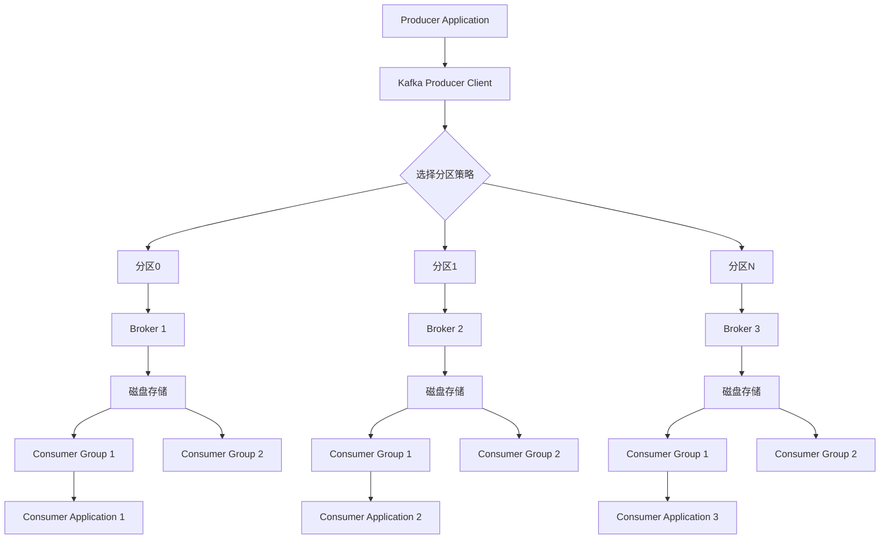
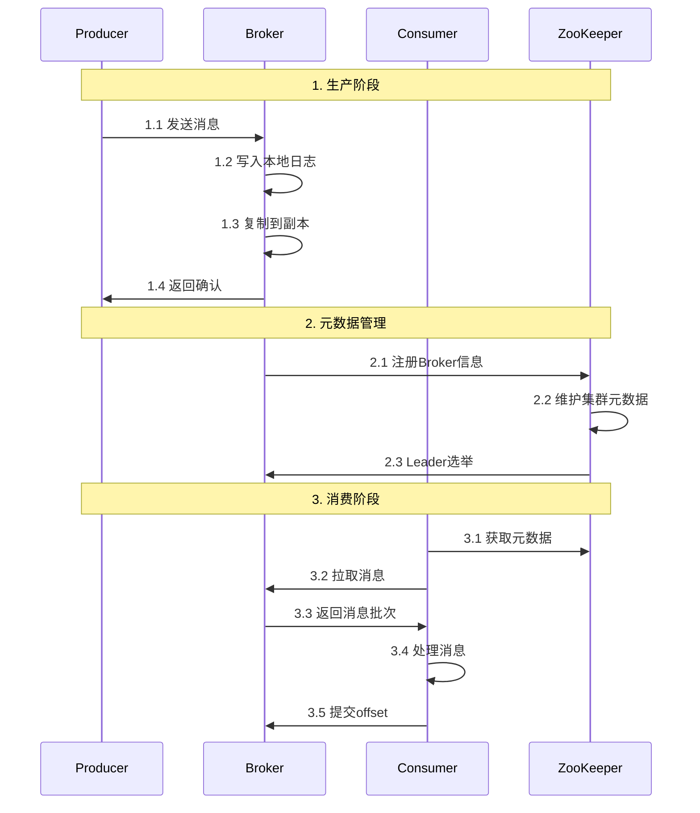
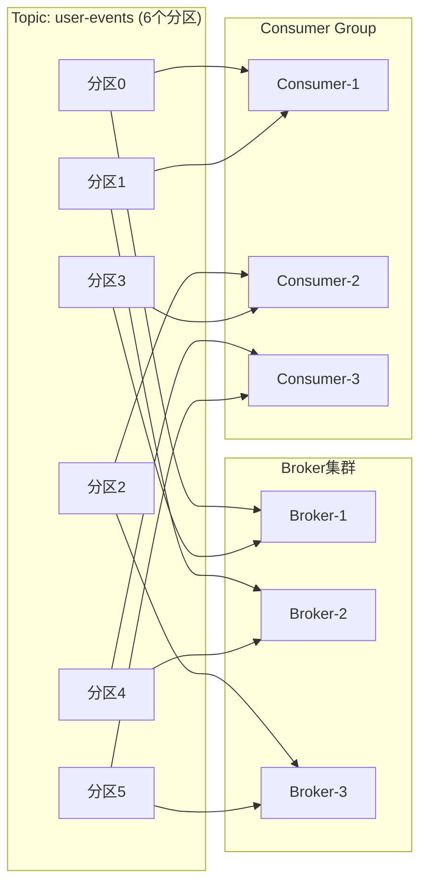
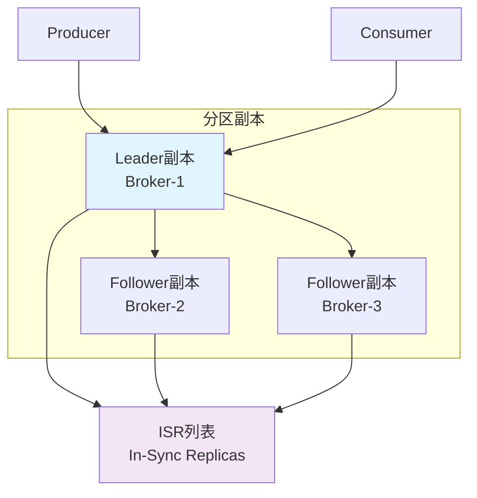
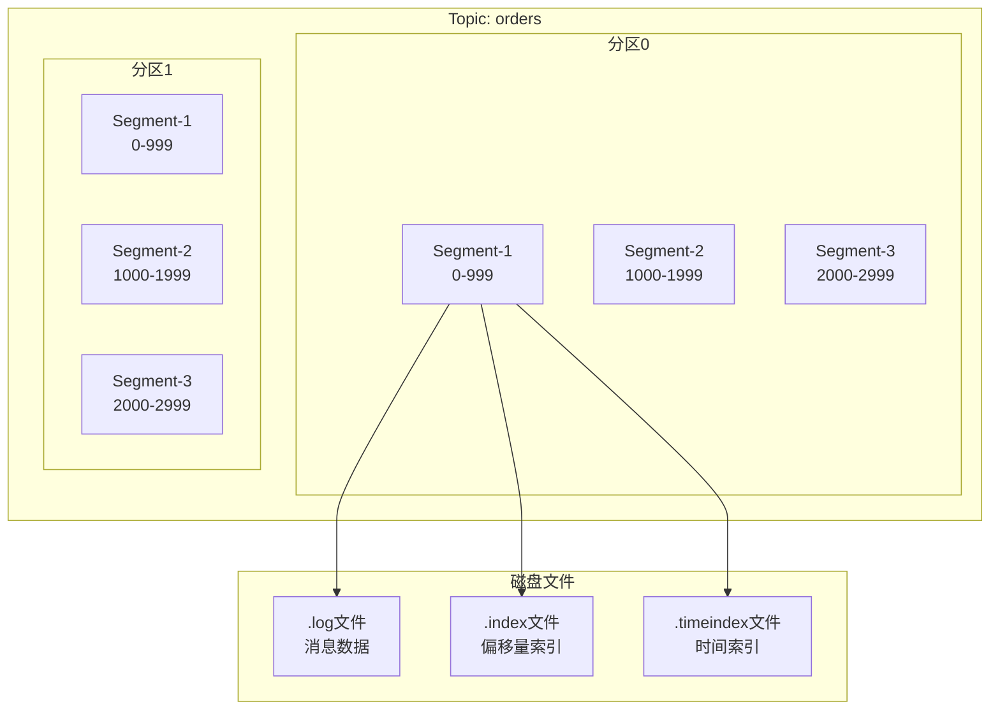
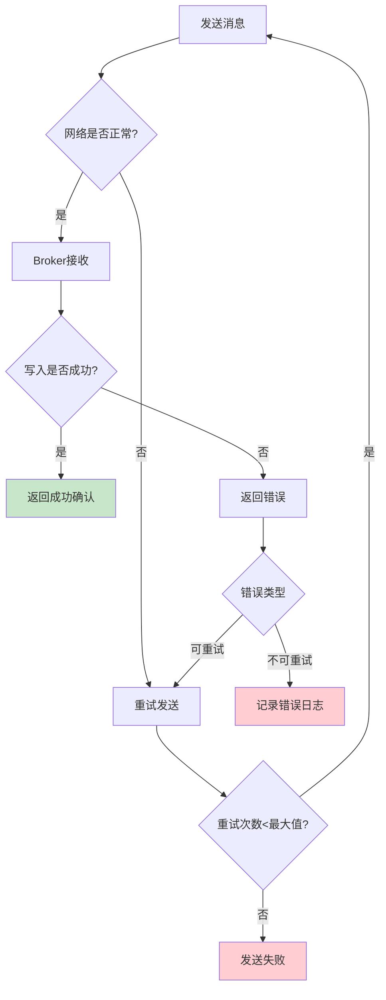
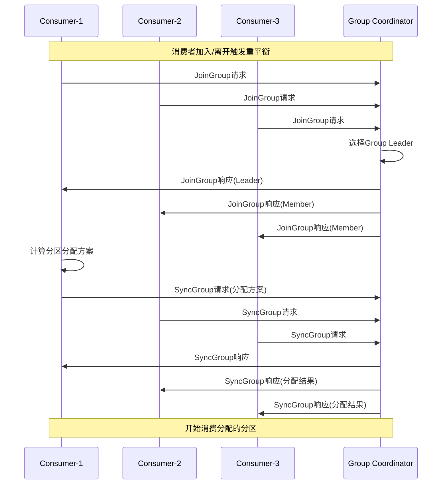

# Kafka 处理流程图

## 1. 消息生产和消费流程

```mermaid
graph TD
    A[Producer Application] --> B[Kafka Producer Client]
    B --> C{选择分区策略}
    C --> D[分区0]
    C --> E[分区1]
    C --> F[分区N]
    
    D --> G[Broker 1]
    E --> H[Broker 2]
    F --> I[Broker 3]
    
    G --> J[磁盘存储]
    H --> K[磁盘存储]
    I --> L[磁盘存储]
    
    J --> M[Consumer Group 1]
    K --> N[Consumer Group 1]
    L --> O[Consumer Group 1]
    
    J --> P[Consumer Group 2]
    K --> Q[Consumer Group 2]
    L --> R[Consumer Group 2]
    
    M --> S[Consumer Application 1]
    N --> T[Consumer Application 2]
    O --> U[Consumer Application 3]
```

## 2. 详细消息处理流程

```mermaid
sequenceDiagram
    participant P as Producer
    participant B as Broker
    participant C as Consumer
    participant Z as ZooKeeper
    
    Note over P,Z: 1. 生产阶段
    P->>B: 1.1 发送消息
    B->>B: 1.2 写入本地日志
    B->>B: 1.3 复制到副本
    B->>P: 1.4 返回确认
    
    Note over P,Z: 2. 元数据管理
    B->>Z: 2.1 注册Broker信息
    Z->>Z: 2.2 维护集群元数据
    Z->>B: 2.3 Leader选举
    
    Note over P,Z: 3. 消费阶段
    C->>Z: 3.1 获取元数据
    C->>B: 3.2 拉取消息
    B->>C: 3.3 返回消息批次
    C->>C: 3.4 处理消息
    C->>B: 3.5 提交offset
```

## 3. 分区分配和负载均衡

```mermaid
graph LR
    subgraph "Topic: user-events (6个分区)"
        P0[分区0]
        P1[分区1]
        P2[分区2]
        P3[分区3]
        P4[分区4]
        P5[分区5]
    end
    
    subgraph "Broker集群"
        B1[Broker-1]
        B2[Broker-2]
        B3[Broker-3]
    end
    
    subgraph "Consumer Group"
        C1[Consumer-1]
        C2[Consumer-2]
        C3[Consumer-3]
    end
    
    P0 --> B1
    P1 --> B2
    P2 --> B3
    P3 --> B1
    P4 --> B2
    P5 --> B3
    
    P0 --> C1
    P1 --> C1
    P2 --> C2
    P3 --> C2
    P4 --> C3
    P5 --> C3
```

## 4. 副本同步机制

```mermaid
graph TD
    subgraph "分区副本"
        L[Leader副本<br/>Broker-1]
        F1[Follower副本<br/>Broker-2]
        F2[Follower副本<br/>Broker-3]
    end
    
    P[Producer] --> L
    L --> F1
    L --> F2
    
    L --> ISR[ISR列表<br/>In-Sync Replicas]
    F1 --> ISR
    F2 --> ISR
    
    C[Consumer] --> L
    
    style L fill:#e1f5fe
    style ISR fill:#f3e5f5
```

## 5. 消息存储结构

```mermaid
graph TD
    subgraph "Topic: orders"
        subgraph "分区0"
            S1[Segment-1<br/>0-999]
            S2[Segment-2<br/>1000-1999]
            S3[Segment-3<br/>2000-2999]
        end
        
        subgraph "分区1"
            S4[Segment-1<br/>0-999]
            S5[Segment-2<br/>1000-1999]
            S6[Segment-3<br/>2000-2999]
        end
    end
    
    subgraph "磁盘文件"
        L1[.log文件<br/>消息数据]
        I1[.index文件<br/>偏移量索引]
        T1[.timeindex文件<br/>时间索引]
    end
    
    S1 --> L1
    S1 --> I1
    S1 --> T1
```

## 6. 错误处理和重试机制

```mermaid
graph TD
    A[发送消息] --> B{网络是否正常?}
    B -->|是| C[Broker接收]
    B -->|否| D[重试发送]
    
    C --> E{写入是否成功?}
    E -->|是| F[返回成功确认]
    E -->|否| G[返回错误]
    
    D --> H{重试次数<最大值?}
    H -->|是| A
    H -->|否| I[发送失败]
    
    G --> J{错误类型}
    J -->|可重试| D
    J -->|不可重试| K[记录错误日志]
    
    style F fill:#c8e6c9
    style I fill:#ffcdd2
    style K fill:#ffcdd2
```

## 7. Consumer Group 重平衡流程

```mermaid
sequenceDiagram
    participant C1 as Consumer-1
    participant C2 as Consumer-2
    participant C3 as Consumer-3
    participant GC as Group Coordinator
    
    Note over C1,GC: 消费者加入/离开触发重平衡
    
    C1->>GC: JoinGroup请求
    C2->>GC: JoinGroup请求
    C3->>GC: JoinGroup请求
    
    GC->>GC: 选择Group Leader
    GC->>C1: JoinGroup响应(Leader)
    GC->>C2: JoinGroup响应(Member)
    GC->>C3: JoinGroup响应(Member)
    
    C1->>C1: 计算分区分配方案
    C1->>GC: SyncGroup请求(分配方案)
    C2->>GC: SyncGroup请求
    C3->>GC: SyncGroup请求
    
    GC->>C1: SyncGroup响应
    GC->>C2: SyncGroup响应(分配结果)
    GC->>C3: SyncGroup响应(分配结果)
    
    Note over C1,GC: 开始消费分配的分区
```