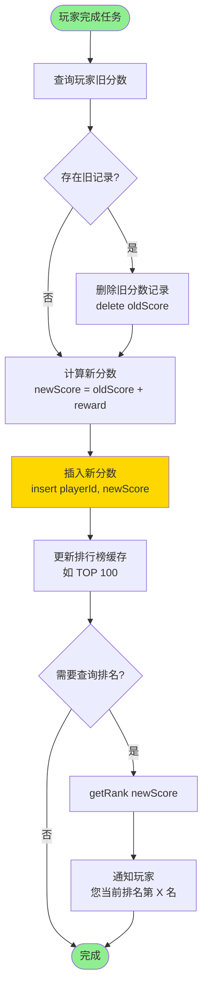
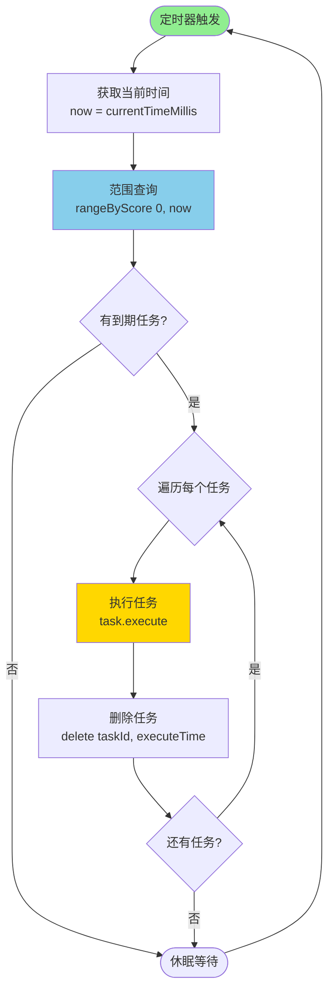
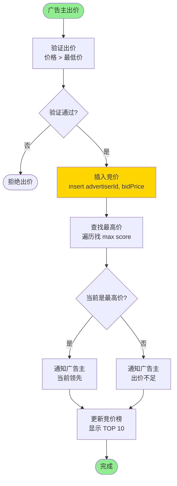

# 跳表（Skip List）核心流程图

## 目录
1. [跳表结构示意图](#跳表结构示意图)
2. [插入操作流程](#插入操作流程)
3. [删除操作流程](#删除操作流程)
4. [查找操作流程](#查找操作流程)
5. [范围查询流程](#范围查询流程)
6. [排名查询流程](#排名查询流程)

---

## 跳表结构示意图

```
跳表多层索引结构：

Level 3: head ---------------------------------> node(2500)
                |                                    |
Level 2: head --------> node(1800) -------------> node(2500)
                |           |                        |
Level 1: head --------> node(1800) -> node(2100) -> node(2500)
                |           |            |             |
Level 0: head -> node(1500) -> node(1800) -> node(1900) -> node(2100) -> node(2200) -> node(2500)

说明：
- head：哨兵节点（不存储数据）
- 每个节点包含：value（数据）、score（分数）、forward[]（前向指针数组）
- 层级越高，跳跃的距离越大，查找速度越快
- 最底层（Level 0）包含所有节点，是完整的有序链表
```

---

## 插入操作流程

```mermaid
flowchart TD
    Start([开始: insert value, score]) --> Init[初始化 update 数组<br/>用于记录每层的前驱节点]
    Init --> SetCurrent[设置 current = head<br/>从最高层开始]

    SetCurrent --> LoopLevel{遍历每一层<br/>i = level-1 down to 0}

    LoopLevel -->|每层| SearchForward{current.forward[i] != null<br/>且 score 更大?}
    SearchForward -->|是| MoveForward[current = current.forward[i]<br/>继续向前搜索]
    MoveForward --> SearchForward

    SearchForward -->|否| RecordUpdate[update[i] = current<br/>记录该层的前驱节点]
    RecordUpdate --> NextLevel{还有下一层?}
    NextLevel -->|是| LoopLevel

    NextLevel -->|否| RandomLevel[随机生成新节点层数<br/>newLevel = randomLevel]

    RandomLevel --> CheckLevel{newLevel > level?}
    CheckLevel -->|是| UpdateHead[将新层的 update<br/>指向 head]
    CheckLevel -->|否| CreateNode[创建新节点<br/>newNode score, value, newLevel]
    UpdateHead --> UpdateLevel[更新跳表层数<br/>level = newLevel]
    UpdateLevel --> CreateNode

    CreateNode --> InsertLoop{遍历新节点的每一层<br/>i = 0 to newLevel-1}

    InsertLoop -->|每层| LinkNode1[newNode.forward[i] = update[i].forward[i]]
    LinkNode1 --> LinkNode2[update[i].forward[i] = newNode]
    LinkNode2 --> InsertNext{还有层?}
    InsertNext -->|是| InsertLoop
    InsertNext -->|否| End([插入完成])

    style Start fill:#90EE90
    style End fill:#FFB6C1
    style RandomLevel fill:#FFD700
    style CreateNode fill:#87CEEB
```

### 插入操作详细步骤说明

```
1. 初始化阶段
   ├─ 创建 update[MAX_LEVEL] 数组
   └─ 用于记录每层需要更新的前驱节点

2. 查找插入位置（从高到低）
   ├─ Level 3: 快速跳跃，找到大致区域
   ├─ Level 2: 继续缩小范围
   ├─ Level 1: 进一步定位
   └─ Level 0: 精确定位插入位置

3. 随机层数生成
   ├─ P = 0.25 的概率晋升到下一层
   ├─ 最大层数 = 32
   └─ 期望层数 = log₁/ₚ(N) ≈ log₄(N)

4. 创建并插入新节点
   ├─ 从 Level 0 到 Level newLevel-1
   ├─ 每层更新前驱节点的 forward 指针
   └─ 新节点的 forward 指针指向原后继节点

时间复杂度：O(logN)
空间复杂度：O(1)
```

---

## 删除操作流程

```mermaid
flowchart TD
    Start([开始: delete value, score]) --> Init[初始化 update 数组]
    Init --> SetCurrent[current = head<br/>从最高层开始]

    SetCurrent --> LoopLevel{遍历每一层<br/>i = level-1 down to 0}

    LoopLevel -->|每层| SearchForward{current.forward[i] != null<br/>且 score 更大?}
    SearchForward -->|是| MoveForward[current = current.forward[i]]
    MoveForward --> SearchForward

    SearchForward -->|否| RecordUpdate[update[i] = current]
    RecordUpdate --> NextLevel{还有下一层?}
    NextLevel -->|是| LoopLevel

    NextLevel -->|否| GetTarget[current = current.forward[0]<br/>获取目标节点]

    GetTarget --> CheckTarget{current != null 且<br/>score 匹配 且<br/>value 匹配?}

    CheckTarget -->|否| NotFound([返回 false<br/>节点不存在])

    CheckTarget -->|是| DeleteLoop{遍历每一层<br/>i = 0 to level-1}

    DeleteLoop -->|每层| CheckUpdate{update[i].forward[i]<br/>== current?}
    CheckUpdate -->|否| BreakLoop[跳出循环<br/>更高层没有此节点]
    CheckUpdate -->|是| UpdateLink[update[i].forward[i] = current.forward[i]<br/>删除指针连接]

    UpdateLink --> DeleteNext{还有层?}
    DeleteNext -->|是| DeleteLoop
    DeleteNext -->|否| AdjustLevel{检查层数}

    BreakLoop --> AdjustLevel

    AdjustLevel --> CheckEmpty{head.forward[level-1]<br/>== null?}
    CheckEmpty -->|是| DecreaseLevel[level--<br/>降低跳表层数]
    DecreaseLevel --> CheckEmpty
    CheckEmpty -->|否| Success([返回 true<br/>删除成功])

    style Start fill:#90EE90
    style NotFound fill:#FFB6C1
    style Success fill:#90EE90
    style DeleteLoop fill:#FFD700
```

### 删除操作详细步骤说明

```
1. 查找目标节点
   ├─ 从最高层开始遍历
   ├─ 记录每层的前驱节点（update数组）
   └─ 最终定位到 Level 0 的目标节点

2. 验证节点
   ├─ 检查 score 是否匹配
   ├─ 检查 value 是否匹配
   └─ 不匹配则返回 false

3. 删除节点
   ├─ 从 Level 0 开始向上
   ├─ 更新每层前驱节点的 forward 指针
   └─ 跳过目标节点，指向其后继

4. 调整层数
   ├─ 检查最高层是否为空
   ├─ 如果为空，层数减1
   └─ 重复检查直到最高层有节点

时间复杂度：O(logN)
空间复杂度：O(1)
```

---

## 查找操作流程

```mermaid
flowchart TD
    Start([开始: search score]) --> SetCurrent[current = head<br/>从最高层开始]

    SetCurrent --> LoopLevel{遍历每一层<br/>i = level-1 down to 0}

    LoopLevel -->|每层| CheckForward{current.forward[i] != null<br/>且 score 更大?}

    CheckForward -->|是| MoveForward[current = current.forward[i]<br/>向前跳跃]
    MoveForward --> CheckForward

    CheckForward -->|否| NextLevel{还有下一层?}
    NextLevel -->|是| LoopLevel

    NextLevel -->|否| GetNode[current = current.forward[0]<br/>移动到 Level 0 的下一个节点]

    GetNode --> CheckMatch{current != null 且<br/>current.score == score?}

    CheckMatch -->|是| Found([返回 current<br/>找到目标节点])
    CheckMatch -->|否| NotFound([返回 null<br/>未找到])

    style Start fill:#90EE90
    style Found fill:#90EE90
    style NotFound fill:#FFB6C1
    style MoveForward fill:#87CEEB
```

### 查找操作详细步骤说明

```
查找过程示例（查找 score = 2100）：

Level 3: head ─────────────────────────────────→ node(2500)
                                                    ↓ (2500 > 2100，停止)
Level 2: head ─────────→ node(1800) ─────────────→ node(2500)
                            ↓ (继续向下)
Level 1: head ─────────→ node(1800) → node(2100)
                                         ↓ (找到！)
Level 0: head → node(1500) → node(1800) → node(1900) → node(2100) ✓

关键点：
1. 从高层开始，快速跳过小于目标的节点
2. 遇到大于等于目标的节点，转到下一层
3. 重复过程直到 Level 0
4. 在 Level 0 验证是否精确匹配

时间复杂度：O(logN)
- 每层期望搜索步数：1/p = 4
- 层数：log₄(N)
- 总搜索步数：4 * log₄(N) = O(logN)

空间复杂度：O(1)
```

---

## 范围查询流程

```mermaid
flowchart TD
    Start([开始: rangeByScore<br/>minScore, maxScore]) --> InitList[创建结果列表<br/>result = new ArrayList]

    InitList --> SetCurrent[current = head<br/>从最高层开始]

    SetCurrent --> FindStart{查找第一个 >= minScore 的节点}

    FindStart --> LoopLevel{遍历每一层<br/>i = level-1 down to 0}

    LoopLevel -->|每层| CheckForward{current.forward[i] != null<br/>且 score < minScore?}

    CheckForward -->|是| MoveForward[current = current.forward[i]<br/>继续向前]
    MoveForward --> CheckForward

    CheckForward -->|否| NextLevel{还有下一层?}
    NextLevel -->|是| LoopLevel

    NextLevel -->|否| MoveToStart[current = current.forward[0]<br/>移到 Level 0 的起始节点]

    MoveToStart --> CollectLoop{current != null 且<br/>score <= maxScore?}

    CollectLoop -->|是| AddToResult[result.add current<br/>添加到结果列表]
    AddToResult --> MoveNext[current = current.forward[0]<br/>移动到下一个节点]
    MoveNext --> CollectLoop

    CollectLoop -->|否| Return([返回 result<br/>返回结果列表])

    style Start fill:#90EE90
    style Return fill:#90EE90
    style FindStart fill:#FFD700
    style CollectLoop fill:#87CEEB
```

### 范围查询详细步骤说明

```
范围查询示例（查询 score ∈ [1800, 2200]）：

Step 1: 快速定位到 minScore = 1800
Level 3: head ─────────────────────→ node(2500)
                                       (2500 > 1800，转下层)
Level 2: head ─────→ node(1800) ✓
                       ↓
Level 0: head → node(1500) → node(1800) ← 起始点

Step 2: 从起始点遍历收集
node(1800) ✓ → result.add
node(1900) ✓ → result.add
node(2100) ✓ → result.add
node(2200) ✓ → result.add
node(2500) ✗ (2500 > 2200，停止)

返回：[node(1800), node(1900), node(2100), node(2200)]

性能分析：
- 定位起始点：O(logN)
- 收集结果：O(M)，M = 结果数量
- 总时间复杂度：O(logN + M)

应用场景：
1. 游戏排行榜：查询分数在 1000-2000 的玩家
2. 延迟任务：获取当前时间前的所有任务
3. 价格区间：查询价格在 50-100 的商品
```

---

## 排名查询流程

```mermaid
flowchart TD
    Start([开始: getRank score]) --> Init[初始化<br/>current = head<br/>rank = 0]

    Init --> LoopLevel{遍历每一层<br/>i = level-1 down to 0}

    LoopLevel -->|每层| CheckForward{current.forward[i] != null<br/>且 score 更大?}

    CheckForward -->|是| CountNodes[统计跨越的节点数<br/>从 current 到 current.forward[i]]

    CountNodes --> TempLoop[temp = current]
    TempLoop --> CountCheck{temp.forward[0]<br/>!= current.forward[i]?}
    CountCheck -->|是| IncrRank1[rank++<br/>temp = temp.forward[0]]
    IncrRank1 --> CountCheck

    CountCheck -->|否| IncrRank2[rank++<br/>计入 forward[i] 本身]
    IncrRank2 --> MoveForward[current = current.forward[i]]
    MoveForward --> CheckForward

    CheckForward -->|否| NextLevel{还有下一层?}
    NextLevel -->|是| LoopLevel

    NextLevel -->|否| Return([返回 rank<br/>返回排名])

    style Start fill:#90EE90
    style Return fill:#90EE90
    style CountNodes fill:#FFD700
    style LoopLevel fill:#87CEEB
```

### 排名查询详细步骤说明

```
排名查询示例（查询 score = 2100 的排名）：

跳表结构：
Level 2: head ─────→ node(1800) ───────────→ node(2500)
Level 1: head ─────→ node(1800) → node(2100) → node(2500)
Level 0: head → node(1500) → node(1800) → node(1900) → node(2100) → node(2200) → node(2500)

查找过程：
1. Level 2:
   - head → node(1800)：跨越 2 个节点（1500, 1800）
   - rank = 2
   - node(1800) → node(2500)：2500 > 2100，停止

2. Level 1:
   - node(1800) → node(2100)：跨越 2 个节点（1900, 2100）
   - rank = 2 + 2 = 4
   - 找到目标

3. 结果：rank = 4（从0开始计数，表示第5名）

时间复杂度：O(logN)

实际应用：
- 游戏排行榜：查询玩家排名
- 成绩排名：查询学生排名
- 销售排行：查询商品销量排名
```

---

## 业务场景应用流程

### 场景1：游戏排行榜更新流程



### 场景2：延迟任务执行流程



### 场景3：实时竞价流程



---

## 性能对比表

| 操作 | 跳表 | 平衡树 | 链表 | 数组 |
|-----|------|--------|------|------|
| 插入 | O(logN) | O(logN) | O(N) | O(N) |
| 删除 | O(logN) | O(logN) | O(N) | O(N) |
| 查找 | O(logN) | O(logN) | O(N) | O(logN)* |
| 范围查询 | O(logN+M) | O(logN+M) | O(N) | O(logN+M)* |
| 空间复杂度 | O(N) | O(N) | O(N) | O(N) |
| 实现难度 | 简单 | 复杂 | 简单 | 简单 |
| 缓存友好 | 中等 | 差 | 好 | 好 |

\* 数组需要有序且使用二分查找

---

## 跳表优化技巧

### 1. 层数优化
```
标准概率：P = 0.25
- 期望层数：E(Level) = 1/(1-P) = 1.33
- 最大层数：32（支持 2^32 个元素）

调整建议：
- 数据量小（< 10000）：MAX_LEVEL = 16
- 数据量大（> 1000000）：MAX_LEVEL = 32
- P 值越小，空间越省，但查找稍慢
```

### 2. 内存优化
```
节点结构优化：
- 使用对象池减少 GC
- 动态分配 forward 数组大小
- 压缩存储 score（使用 float 代替 double）
```

### 3. 并发优化
```
锁粒度优化：
- 读写锁：读多写少场景
- 分段锁：将跳表分段加锁
- 无锁实现：使用 CAS 操作（复杂）
```

---

## 总结

跳表是一种优雅的数据结构，特点：
1. ✅ 实现简单，易于理解
2. ✅ 性能稳定，O(logN)操作
3. ✅ 支持范围查询
4. ✅ 并发友好（相比平衡树）
5. ✅ 内存占用合理

适用场景：
- 🎮 排行榜系统
- ⏰ 延迟任务队列
- 💰 实时竞价系统
- 📊 有序数据维护
- 🔍 范围查询需求

Redis 选择跳表的原因：
- 实现简单，代码可维护性好
- 范围查询性能优秀（ZRANGE 命令）
- 支持高效的排名操作（ZRANK 命令）
- 内存占用可接受
- 适合做持久化
