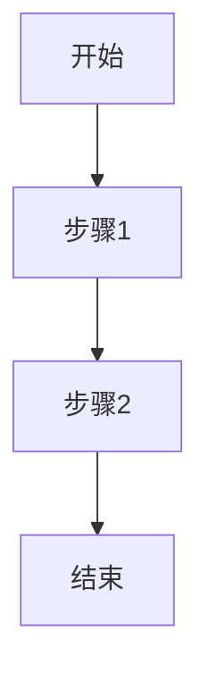

# 开源代码学习指南

## 目录
1. [为什么要学习开源代码](#为什么要学习开源代码)
2. [如何选择开源项目](#如何选择开源项目)
3. [开源代码阅读方法](#开源代码阅读方法)
4. [学习路径和策略](#学习路径和策略)
5. [实用工具和技巧](#实用工具和技巧)
6. [常见问题和解决方案](#常见问题和解决方案)
7. [进阶学习建议](#进阶学习建议)

## 为什么要学习开源代码

### 1. 技术提升
- **最佳实践学习**: 学习业界顶尖开发者的编程技巧和设计模式
- **架构设计理解**: 深入理解大型系统的架构设计思路
- **代码质量标准**: 学习高质量代码的编写规范和标准
- **性能优化技巧**: 了解各种性能优化的实现方法

### 2. 职业发展
- **技术深度**: 通过阅读源码提升技术深度和广度
- **面试准备**: 开源项目经验是技术面试的重要加分项
- **行业认知**: 了解技术发展趋势和行业标准
- **个人品牌**: 参与开源项目提升个人技术影响力

### 3. 解决问题能力
- **调试技能**: 学会如何定位和解决复杂问题
- **源码调试**: 掌握从源码层面分析问题的能力
- **系统思维**: 培养系统性思考和解决问题的能力

## 如何选择开源项目

### 1. 选择标准

#### 技术相关性
- **工作相关**: 选择与当前工作技术栈相关的项目
- **兴趣驱动**: 选择自己感兴趣的技术领域
- **学习目标**: 明确想要学习的技术点

#### 项目质量评估
```bash
# 检查项目活跃度
git log --oneline --since="1 month ago" | wc -l

# 查看贡献者数量
git shortlog -sn | head -10

# 检查代码质量指标
find . -name "*.java" | xargs wc -l | tail -1
```

#### 项目规模选择
- **初学者**: 选择小型项目（1000-5000行代码）
- **进阶者**: 选择中型项目（5000-50000行代码）
- **高级者**: 选择大型项目（50000+行代码）

### 2. 推荐项目类别

#### Java生态系统
```
框架类:
- Spring Framework (企业级应用框架)
- MyBatis (持久层框架)
- Netty (网络通信框架)

工具类:
- Apache Commons (工具库集合)
- Guava (Google工具库)
- Jackson (JSON处理库)

中间件:
- Apache Kafka (消息队列)
- Elasticsearch (搜索引擎)
- Redis (缓存数据库)
```

#### 按学习目标分类
```
设计模式学习:
- Spring Framework (依赖注入、AOP等)
- JUnit (测试框架设计)

并发编程:
- Netty (NIO和并发处理)
- Disruptor (高性能并发框架)

分布式系统:
- Apache Dubbo (RPC框架)
- Apache Zookeeper (分布式协调)
```

## 开源代码阅读方法

### 1. 准备阶段

#### 环境搭建
```bash
# 1. 克隆项目
git clone https://github.com/spring-projects/spring-framework.git
cd spring-framework

# 2. 查看项目结构
tree -L 2

# 3. 查看构建说明
cat README.md
cat CONTRIBUTING.md

# 4. 构建项目
./gradlew build
```

#### 文档阅读
- **README.md**: 项目概述和快速开始
- **CONTRIBUTING.md**: 贡献指南和开发规范
- **CHANGELOG.md**: 版本变更历史
- **docs/**: 详细文档和设计说明

### 2. 代码阅读策略

#### 自顶向下方法
```
1. 项目整体架构
   ├── 模块划分
   ├── 依赖关系
   └── 核心组件

2. 核心模块分析
   ├── 主要接口
   ├── 实现类
   └── 设计模式

3. 具体实现细节
   ├── 算法实现
   ├── 数据结构
   └── 性能优化
```

#### 自底向上方法
```
1. 从测试用例开始
   ├── 理解功能需求
   ├── 学习使用方法
   └── 验证理解

2. 跟踪执行流程
   ├── 调试关键路径
   ├── 理解调用链
   └── 分析数据流

3. 深入核心实现
   ├── 算法分析
   ├── 设计思路
   └── 优化技巧
```

### 3. 实用阅读技巧

#### 使用IDE功能
```java
// 1. 查找类的所有实现
// Ctrl+H (Eclipse) / Cmd+Shift+F12 (IntelliJ)

// 2. 查找方法调用
// Ctrl+Shift+G (Eclipse) / Alt+F7 (IntelliJ)

// 3. 查看类继承关系
// F4 (Eclipse) / Ctrl+H (IntelliJ)

// 4. 跳转到定义
// F3 (Eclipse) / Ctrl+B (IntelliJ)
```

#### 代码注释和文档
```java
/**
 * 重点关注的注释类型:
 * 1. 类级别的JavaDoc - 了解类的职责和设计意图
 * 2. 方法级别的注释 - 理解方法的功能和参数
 * 3. 复杂逻辑的行内注释 - 理解实现细节
 * 4. TODO和FIXME - 了解已知问题和改进点
 */
```

## 学习路径和策略

### 1. 阶段性学习计划

#### 第一阶段：基础理解（1-2周）
```
目标: 理解项目整体结构和核心概念

任务清单:
□ 阅读项目文档和README
□ 搭建开发环境并成功构建
□ 运行示例代码和测试用例
□ 绘制项目模块结构图
□ 理解核心接口和抽象类
```

#### 第二阶段：深入分析（2-4周）
```
目标: 深入理解核心模块的实现

任务清单:
□ 选择1-2个核心模块深入研究
□ 跟踪关键功能的执行流程
□ 分析设计模式的使用
□ 理解异常处理机制
□ 学习配置和扩展机制
```

#### 第三阶段：实践应用（2-3周）
```
目标: 通过实践加深理解

任务清单:
□ 修改配置参数观察行为变化
□ 编写自定义扩展或插件
□ 修复简单的bug或添加小功能
□ 编写技术博客总结学习心得
□ 参与社区讨论和问答
```

### 2. 学习记录方法

#### 代码笔记模板
```markdown
## 模块名称: [模块名]
### 核心功能
- 功能1: 描述
- 功能2: 描述

### 关键类和接口
| 类名 | 职责 | 设计模式 |
|------|------|----------|
| ClassA | 描述 | 单例模式 |
| ClassB | 描述 | 工厂模式 |

### 执行流程


### 学习收获
- 技术点1: 具体描述
- 技术点2: 具体描述

### 疑问和TODO
- [ ] 问题1: 描述
- [ ] 问题2: 描述
```

## 实用工具和技巧

### 1. 开发工具配置

#### IntelliJ IDEA 配置
```properties
# 代码阅读优化配置
# File -> Settings -> Editor

# 1. 显示行号和方法分隔符
Editor.General.Appearance.Show line numbers = true
Editor.General.Appearance.Show method separators = true

# 2. 代码折叠配置
Editor.General.Code Folding.Collapse by default = false

# 3. 字体和颜色配置
Editor.Font.Size = 14
Editor.Color Scheme = Darcula
```

#### 有用的插件
```
代码分析:
- SonarLint: 代码质量检查
- CheckStyle: 代码规范检查
- SpotBugs: Bug检测

文档和注释:
- PlantUML: UML图表生成
- Markdown Navigator: Markdown支持
- JavaDoc: 文档生成

版本控制:
- GitToolBox: Git增强功能
- Git Flow Integration: Git工作流支持
```

### 2. 命令行工具

#### Git 分析命令
```bash
# 查看项目统计信息
git log --pretty=format: --name-only | sort | uniq -c | sort -rg | head -10

# 查看代码贡献者
git shortlog -sn

# 查看文件修改历史
git log --follow -p filename

# 查看某个时间段的提交
git log --since="2023-01-01" --until="2023-12-31" --oneline

# 查看代码行数统计
git ls-files | xargs wc -l
```

#### 代码分析工具
```bash
# 使用cloc统计代码行数
cloc . --exclude-dir=target,node_modules

# 使用grep查找特定模式
grep -r "pattern" --include="*.java" .

# 查找TODO和FIXME
grep -rn "TODO\|FIXME" --include="*.java" .
```

### 3. 在线工具

#### 代码浏览和搜索
```
GitHub功能:
- Code Search: 全局代码搜索
- Blame View: 查看代码修改历史
- Network Graph: 查看分支和合并历史
- Insights: 项目统计信息

第三方工具:
- Sourcegraph: 强大的代码搜索和导航
- OpenGrok: 源码搜索引擎
- Hound: 快速代码搜索
```

## 常见问题和解决方案

### 1. 技术问题

#### 构建失败
```bash
# 问题: 依赖下载失败
# 解决: 配置国内镜像源

# Maven配置 (~/.m2/settings.xml)
<mirrors>
    <mirror>
        <id>aliyun</id>
        <mirrorOf>central</mirrorOf>
        <url>https://maven.aliyun.com/repository/central</url>
    </mirror>
</mirrors>

# Gradle配置 (gradle.properties)
systemProp.http.proxyHost=127.0.0.1
systemProp.http.proxyPort=1080
```

#### 代码理解困难
```
策略:
1. 从测试用例开始理解功能
2. 使用调试器跟踪执行流程
3. 画出类图和时序图
4. 查找相关技术文档和博客
5. 在社区提问求助
```

### 2. 学习方法问题

#### 进度缓慢
```
解决方案:
1. 设定明确的学习目标和时间计划
2. 选择适合自己水平的项目
3. 加入学习小组或找学习伙伴
4. 定期总结和分享学习成果
5. 不要追求完美，先理解主要流程
```

#### 缺乏动力
```
激励方法:
1. 设定阶段性的小目标
2. 记录学习进度和成果
3. 参与开源社区讨论
4. 将学习成果应用到工作中
5. 分享学习心得获得反馈
```

## 进阶学习建议

### 1. 深度学习方向

#### 架构设计学习
```
学习重点:
- 模块化设计原则
- 接口和抽象的使用
- 依赖注入和控制反转
- 插件化架构设计
- 微服务架构模式
```

#### 性能优化学习
```
关注点:
- 内存管理和垃圾回收
- 并发编程和线程安全
- 缓存策略和数据结构选择
- 网络I/O优化
- 数据库访问优化
```

### 2. 贡献开源项目

#### 从小贡献开始
```
贡献类型:
1. 文档改进 (最容易开始)
2. 测试用例补充
3. Bug修复
4. 功能增强
5. 性能优化
```

#### 贡献流程
```bash
# 1. Fork项目到自己的GitHub
# 2. 克隆到本地
git clone https://github.com/yourusername/project.git

# 3. 创建功能分支
git checkout -b feature/your-feature

# 4. 进行修改和测试
# 5. 提交更改
git commit -m "Add: your feature description"

# 6. 推送到远程仓库
git push origin feature/your-feature

# 7. 创建Pull Request
```

### 3. 建立技术影响力

#### 技术分享
```
分享渠道:
- 技术博客 (掘金、CSDN、个人博客)
- 技术社区 (Stack Overflow、GitHub Discussions)
- 技术会议和Meetup
- 公司内部技术分享
- 开源项目文档贡献
```

#### 持续学习
```
学习资源:
- 官方文档和RFC
- 技术书籍和论文
- 在线课程和视频
- 技术播客和Newsletter
- 开源项目的Issue和PR讨论
```

## 总结

学习开源代码是一个长期的过程，需要：

1. **明确目标**: 根据个人情况选择合适的项目和学习路径
2. **系统方法**: 采用科学的阅读方法和学习策略
3. **实践应用**: 通过实际操作加深理解
4. **持续坚持**: 保持学习热情和长期投入
5. **社区参与**: 积极参与开源社区，获得帮助和反馈

记住，每个优秀的开发者都是从阅读和学习他人的代码开始的。开源代码是最好的老师，它不仅能提升你的技术能力，还能让你了解软件工程的最佳实践。

> 💡 **提示**: 学习开源代码不是一蹴而就的过程，要有耐心和恒心。从小项目开始，逐步挑战更复杂的系统，你会发现自己的技术水平在不知不觉中得到显著提升。