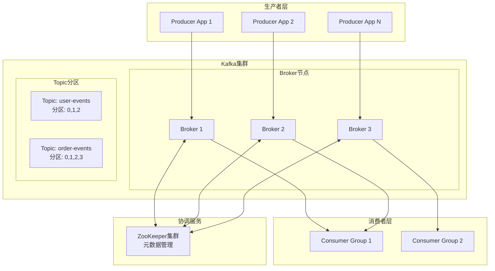
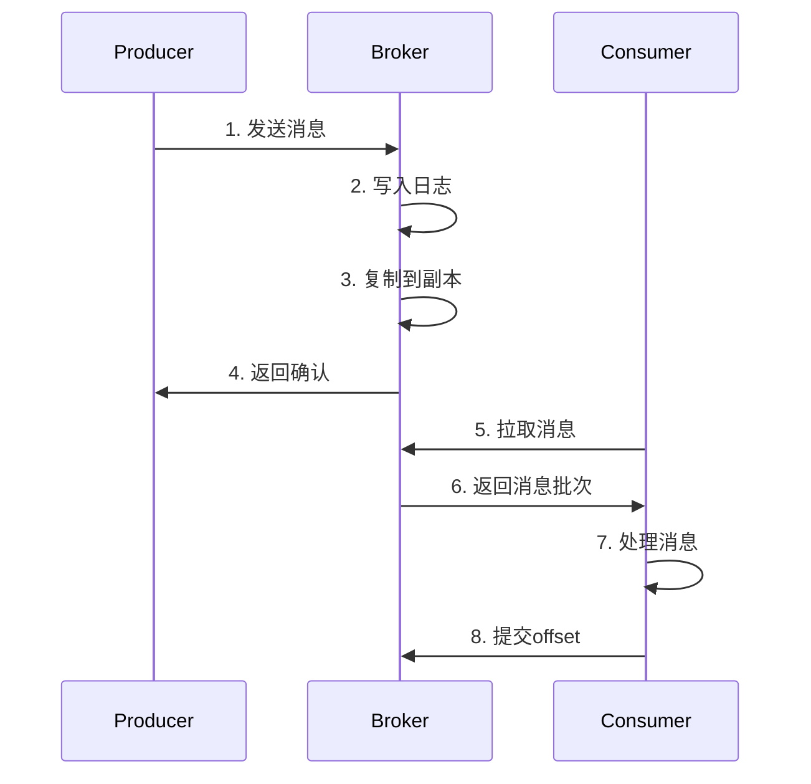

# Apache Kafka 完整实现指南

## 目录
1. [Kafka 原理与背景](#kafka-原理与背景)
2. [核心概念](#核心概念)
3. [应用场景](#应用场景)
4. [商业应用案例](#商业应用案例)
5. [源代码分析](#源代码分析)
6. [实战案例](#实战案例)
7. [面试内容](#面试内容)

## Kafka 原理与背景

### 背景介绍
Apache Kafka 是由 LinkedIn 开发的分布式流处理平台，于 2011 年开源。它最初是为了解决 LinkedIn 内部大规模数据处理的需求而设计的。

### 要解决的核心问题

#### 1. 传统消息系统的局限性
- **吞吐量瓶颈**: 传统消息队列（如 RabbitMQ、ActiveMQ）在高并发场景下性能不足
- **扩展性问题**: 难以水平扩展，单点故障风险高
- **数据持久化**: 消息消费后即删除，无法重复消费历史数据
- **实时性要求**: 无法满足大规模实时数据处理需求

#### 2. 大数据时代的挑战
- **数据量爆炸**: 互联网公司每天产生TB级别的用户行为数据
- **实时处理需求**: 需要实时分析用户行为、推荐系统、监控告警
- **系统解耦**: 微服务架构下，服务间需要可靠的异步通信机制
- **数据集成**: 需要将数据从多个源系统集成到数据仓库或分析系统

#### 3. LinkedIn 的具体痛点
- **活动流数据**: 每天数十亿次用户活动（页面浏览、点击、搜索等）
- **运营指标**: 实时监控网站性能、用户参与度等关键指标
- **数据管道**: 需要可靠的数据管道将数据传输到Hadoop、数据仓库等系统
- **系统集成**: 连接数百个内部服务和数据存储系统

### 设计目标
- **高吞吐量**: 支持每秒数百万条消息的处理
- **低延迟**: 毫秒级的消息传递延迟
- **持久性**: 消息持久化存储，支持数据重放
- **分布式**: 支持集群部署，具备高可用性
- **容错性**: 支持数据复制和故障恢复

### Kafka 的创新解决方案

#### 1. 基于日志的存储模型
- **顺序写入**: 利用磁盘顺序写入的高性能特性
- **分段存储**: 将日志分成多个段，便于管理和清理
- **索引机制**: 通过稀疏索引快速定位消息

#### 2. 分布式架构设计
- **分区机制**: 将Topic分成多个分区，实现水平扩展
- **副本机制**: 每个分区有多个副本，保证数据安全
- **负载均衡**: 分区分布在不同的Broker上，均衡负载

#### 3. 高效的网络协议
- **批量传输**: 批量发送和接收消息，减少网络开销
- **零拷贝**: 利用操作系统的零拷贝技术，减少CPU开销
- **压缩算法**: 支持多种压缩算法，减少网络传输量

### 核心架构

#### 整体架构图

#### 消息处理流程

> 📊 **详细架构图**: 查看 [Kafka架构设计图](docs/kafka-architecture-diagram.md) 和 [处理流程图](docs/kafka-flow-diagram.md)

## 核心概念

### 1. Topic（主题）
- 消息的逻辑分类
- 类似于数据库中的表
- 支持多分区以提高并行度

### 2. Partition（分区）
- Topic 的物理分割
- 每个分区是一个有序的消息序列
- 支持并行消费和负载均衡

### 3. Producer（生产者）
- 向 Kafka 发送消息的客户端
- 支持同步和异步发送
- 可配置分区策略

### 4. Consumer（消费者）
- 从 Kafka 读取消息的客户端
- 支持消费者组概念
- 提供 offset 管理机制

### 5. Broker（代理）
- Kafka 集群中的服务器节点
- 负责存储和转发消息
- 支持副本机制

### 6. ZooKeeper
- 集群元数据管理
- Leader 选举
- 配置管理

## 应用场景

### 1. 消息队列
- 解耦系统组件
- 异步处理
- 削峰填谷

### 2. 日志聚合
- 集中收集应用日志
- 实时日志分析
- 日志存储和归档

### 3. 流处理
- 实时数据处理
- 事件驱动架构
- 复杂事件处理

### 4. 数据集成
- ETL 管道
- 数据同步
- 微服务间通信

### 5. 活动跟踪
- 用户行为分析
- 网站点击流分析
- 实时推荐系统

## 商业应用案例

### 1. LinkedIn
- **场景**: 用户活动跟踪、消息传递
- **规模**: 每天处理超过 1 万亿条消息
- **架构**: 多集群部署，跨数据中心复制

### 2. Netflix
- **场景**: 实时监控、日志聚合、推荐系统
- **规模**: 每天处理数千亿条消息
- **特点**: 使用 Kafka 进行实时数据分析和个性化推荐

### 3. Uber
- **场景**: 实时定位、订单处理、支付系统
- **规模**: 每秒处理数百万条消息
- **架构**: 基于 Kafka 的事件驱动微服务架构

### 4. Airbnb
- **场景**: 用户行为分析、价格优化、欺诈检测
- **特点**: 使用 Kafka Streams 进行实时流处理

### 5. 滴滴出行
- **场景**: 实时订单匹配、司机定位、路径规划
- **规模**: 每天处理数十亿条位置更新消息

## 关键特性

### 1. 高性能
- **零拷贝技术**: 减少数据复制开销
- **批量处理**: 提高网络和磁盘 I/O 效率
- **压缩算法**: 支持 GZIP、Snappy、LZ4 等

### 2. 可扩展性
- **水平扩展**: 通过增加 Broker 节点扩展集群
- **分区机制**: 支持 Topic 分区以提高并行度
- **消费者组**: 支持多消费者并行消费

### 3. 持久性
- **磁盘存储**: 消息持久化到磁盘
- **副本机制**: 支持数据复制以防止数据丢失
- **日志压缩**: 支持基于 Key 的日志压缩

### 4. 容错性
- **副本同步**: ISR（In-Sync Replicas）机制
- **故障恢复**: 自动 Leader 选举
- **数据一致性**: 支持不同级别的一致性保证

## 性能优化

### 1. Producer 优化
- **批量发送**: 配置 `batch.size` 和 `linger.ms`
- **压缩**: 启用消息压缩
- **异步发送**: 使用回调机制
- **幂等性**: 启用 `enable.idempotence`

### 2. Consumer 优化
- **批量拉取**: 配置 `max.poll.records`
- **预取**: 配置 `fetch.min.bytes` 和 `fetch.max.wait.ms`
- **并行消费**: 使用多个消费者实例
- **手动提交**: 控制 offset 提交时机

### 3. Broker 优化
- **内存配置**: 合理配置 JVM 堆内存
- **磁盘配置**: 使用 SSD 提高 I/O 性能
- **网络配置**: 优化网络缓冲区大小
- **副本配置**: 合理设置副本数量

## 监控与运维

### 1. 关键指标
- **吞吐量**: 每秒消息数、字节数
- **延迟**: 端到端延迟、生产延迟、消费延迟
- **可用性**: Broker 状态、分区状态
- **资源使用**: CPU、内存、磁盘、网络

### 2. 监控工具
- **JMX**: Kafka 内置 JMX 指标
- **Kafka Manager**: Web 界面管理工具
- **Confluent Control Center**: 企业级监控平台
- **Prometheus + Grafana**: 开源监控方案

### 3. 运维最佳实践
- **容量规划**: 根据业务需求规划集群容量
- **备份策略**: 定期备份重要数据
- **升级策略**: 滚动升级以减少服务中断
- **安全配置**: 启用认证和授权机制

## 生态系统

### 1. Kafka Connect
- **数据集成**: 连接外部系统
- **连接器**: 丰富的预构建连接器
- **分布式**: 支持分布式部署

### 2. Kafka Streams
- **流处理**: 轻量级流处理库
- **状态存储**: 支持有状态处理
- **容错**: 自动故障恢复

### 3. Schema Registry
- **模式管理**: 管理 Avro、JSON、Protobuf 模式
- **兼容性**: 模式演进和兼容性检查
- **序列化**: 高效的数据序列化

### 4. KSQL
- **SQL 接口**: 使用 SQL 进行流处理
- **实时查询**: 支持实时数据查询
- **易用性**: 降低流处理门槛

## 最佳实践

### 1. 设计原则
- **单一职责**: 每个 Topic 专注于特定的业务领域
- **合理分区**: 根据并发需求设置分区数
- **命名规范**: 使用清晰的命名约定
- **版本管理**: 考虑消息格式的版本演进

### 2. 开发实践
- **错误处理**: 实现完善的错误处理机制
- **监控集成**: 集成应用监控和告警
- **测试策略**: 使用嵌入式 Kafka 进行单元测试
- **文档维护**: 维护完整的 API 文档

### 3. 运维实践
- **环境隔离**: 区分开发、测试、生产环境
- **权限管理**: 实施最小权限原则
- **日志管理**: 集中管理和分析日志
- **性能调优**: 持续监控和优化性能