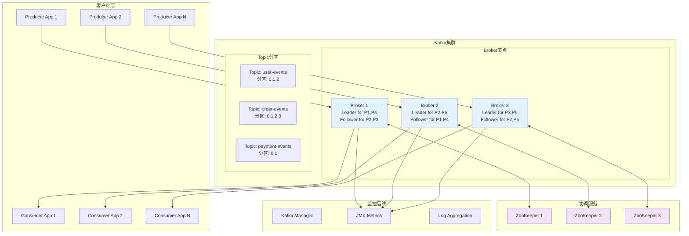
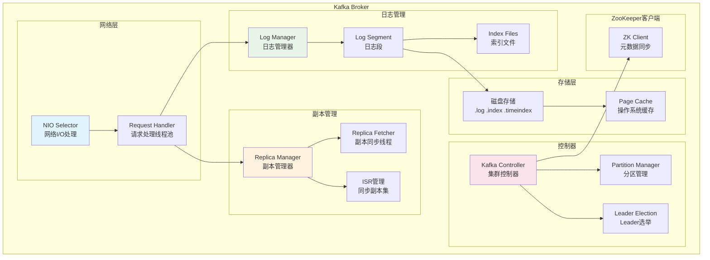
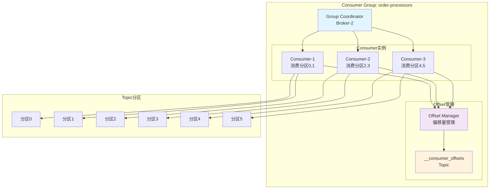
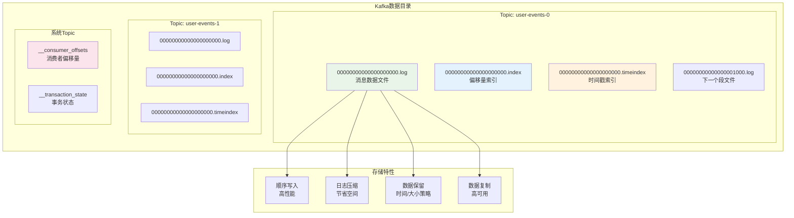
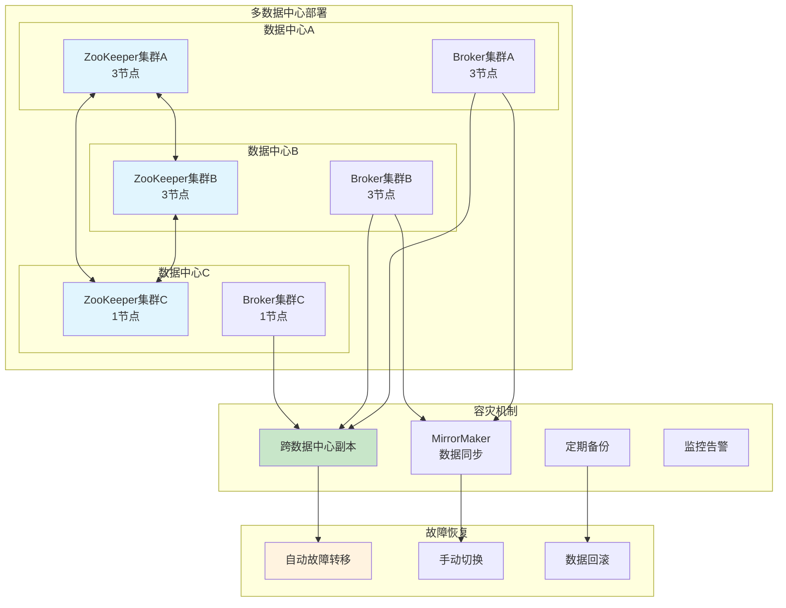

# Kafka 架构设计图

## 1. 整体系统架构



## 2. Broker内部架构



## 3. 分区副本架构

```mermaid
graph TD
    subgraph "Topic: orders (副本因子=3)"
        subgraph "分区0"
            P0L[Leader<br/>Broker-1]
            P0F1[Follower<br/>Broker-2]
            P0F2[Follower<br/>Broker-3]
        end
        
        subgraph "分区1"
            P1L[Leader<br/>Broker-2]
            P1F1[Follower<br/>Broker-1]
            P1F2[Follower<br/>Broker-3]
        end
        
        subgraph "分区2"
            P2L[Leader<br/>Broker-3]
            P2F1[Follower<br/>Broker-1]
            P2F2[Follower<br/>Broker-2]
        end
    end
    
    subgraph "ISR (In-Sync Replicas)"
        ISR0[分区0 ISR<br/>{1,2,3}]
        ISR1[分区1 ISR<br/>{1,2,3}]
        ISR2[分区2 ISR<br/>{1,2,3}]
    end
    
    P0L --> P0F1
    P0L --> P0F2
    P1L --> P1F1
    P1L --> P1F2
    P2L --> P2F1
    P2L --> P2F2
    
    P0L --> ISR0
    P1L --> ISR1
    P2L --> ISR2
    
    style P0L fill:#c8e6c9
    style P1L fill:#c8e6c9
    style P2L fill:#c8e6c9
    style ISR0 fill:#fff9c4
    style ISR1 fill:#fff9c4
    style ISR2 fill:#fff9c4
```

## 4. 消费者组架构



## 5. 数据存储架构



## 6. 网络通信架构

```mermaid
graph LR
    subgraph "Producer"
        PA[Producer API]
        PB[Producer Buffer]
        PS[Partitioner<br/>分区器]
        PN[Network Client]
    end
    
    subgraph "Kafka Protocol"
        REQ[Request/Response<br/>协议]
        BATCH[批量传输]
        COMP[压缩算法]
        ACK[确认机制]
    end
    
    subgraph "Broker"
        NL[Network Layer<br/>网络层]
        RH[Request Handler<br/>请求处理]
        API[Kafka API<br/>处理器]
        RESP[Response<br/>响应]
    end
    
    subgraph "Consumer"
        CF[Consumer Fetcher]
        CB[Consumer Buffer]
        CA[Consumer API]
        CC[Coordinator Client]
    end
    
    PA --> PB
    PB --> PS
    PS --> PN
    PN --> REQ
    
    REQ --> BATCH
    BATCH --> COMP
    COMP --> ACK
    
    ACK --> NL
    NL --> RH
    RH --> API
    API --> RESP
    
    RESP --> CF
    CF --> CB
    CB --> CA
    CA --> CC
    
    style REQ fill:#e1f5fe
    style BATCH fill:#e8f5e8
    style COMP fill:#fff3e0
    style ACK fill:#fce4ec
```



## 7. 高可用架构设计

