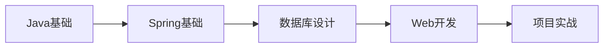
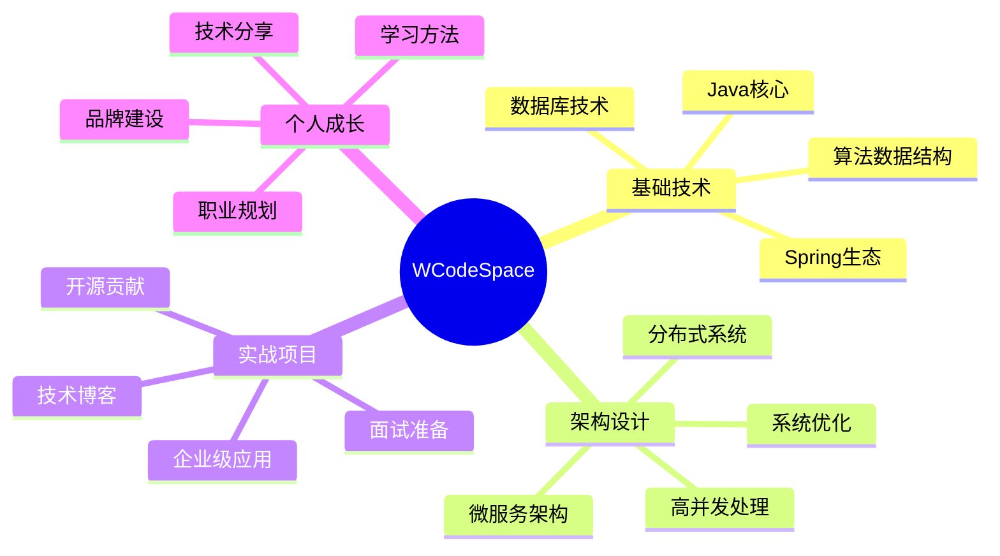

# 🚀 WCodeSpace - 全栈技术成长工作空间

<div align="center">


**🎯 一个包罗万象的技术学习与实践平台，致力于技术能力提升、个人IP打造和前沿趋势跟踪**

[🔗 快速开始](#-快速开始) • [📚 项目结构](#-项目结构) • [🎨 技术栈](#-核心技术栈) • [📖 学习路径](#-学习路径) • [🤝 贡献指南](#-贡献指南)

</div>

---

## 🌟 项目愿景

> **"打造一个集技术学习、实践应用、个人成长于一体的综合性开源平台"**

WCodeSpace 不仅仅是一个代码仓库，更是一个**技术成长生态系统**，旨在帮助开发者：

- 🎯 **技术能力提升** - 从基础到高级的全栈技术实践
- 🚀 **个人IP打造** - 内容创作与品牌建设
- 📈 **趋势跟踪** - 最新技术动态与行业洞察
- 🤝 **知识分享** - 构建技术社区与交流平台

---

## 📚 项目结构

### 🏗️ 核心模块架构

```
WCodeSpace/
├── 🧠 Algorithm/              # 算法与数据结构
├── ⚡ Concurrency/            # 并发编程实战
├── 💾 DataBase/               # 数据库技术专栏
├── 🔗 DataStructure/          # 数据结构深度解析
├── 🎨 DesignPattern/          # 设计模式最佳实践
├── 🌐 DistributedSystem/      # 分布式系统架构
├── 💼 Interview/              # 面试题库与技巧
├── 🔧 Middleware/             # 中间件技术栈
├── 📦 OpenSource/             # 开源框架深度学习
├── 💻 OperatingSystem/        # 操作系统原理
├── 🎭 PersonalIP/             # 个人品牌建设
├── 📖 Reading/                # 技术书籍与学习笔记
├── 📄 Resume/                 # 简历优化与职业规划
├── 🏛️ SoftwareArchitect/      # 软件架构设计
├── 🚀 SoftwareProject/        # 实战项目集合
├── 📊 TechnicalTrends/        # 技术趋势分析
└── 💼 Work/                   # 工作实践与案例
```

---

## 🎯 核心亮点

### 🔥 技术深度覆盖

#### 🌟 Spring生态系统 (OpenSource/Spring)
- **Spring Boot 3.x** - 现代化微服务开发
- **Spring 6.x** - 最新特性与最佳实践
- **AOP编程** - 面向切面编程实战
- **依赖注入** - IoC容器深度解析
- **事件驱动** - 响应式编程模式

```java
@SpringBootApplication
@EnableAsync
@EnableScheduling
public class ModernSpringDemoApplication {
    // 展示Spring Boot 3.x核心特性
}
```

#### 💡 算法与数据结构 (Algorithm)
- 🔍 **查找算法** - 二分查找、哈希查找等
- 📊 **排序算法** - 快排、归并、堆排序等
- 🌳 **树结构** - 二叉树、红黑树、B+树
- 📈 **图算法** - 最短路径、最小生成树
- 🧮 **动态规划** - 经典DP问题解析

#### ⚡ 并发编程 (Concurrency)
- 🔒 **线程安全** - 锁机制与原子操作
- 🚀 **异步编程** - Future、CompletableFuture
- 🔄 **响应式编程** - RxJava、Project Reactor
- 📱 **高并发架构** - 线程池、协程应用

#### 🏗️ 系统设计 (DistributedSystem)
- 🌐 **微服务架构** - Spring Cloud生态
- 📊 **分布式存储** - 分片、复制策略
- 🔄 **消息队列** - Kafka、RabbitMQ
- 🎯 **负载均衡** - Nginx、HAProxy
- 📈 **监控观测** - Prometheus、Grafana

---

## 🎨 核心技术栈

### 后端技术
- **语言**: Java 21, Python, Go
- **框架**: Spring Boot 3.x, Spring Cloud 2024.x
- **数据库**: MySQL 8.0, Redis, MongoDB, PostgreSQL
- **中间件**: Kafka, RabbitMQ, Elasticsearch
- **容器化**: Docker, Kubernetes

### 前端技术  
- **框架**: React 18, Vue 3, Next.js 14
- **构建工具**: Vite, Webpack, Turbopack
- **样式**: Tailwind CSS, Styled Components
- **状态管理**: Redux Toolkit, Zustand

### DevOps & 工具
- **CI/CD**: GitHub Actions, Jenkins
- **监控**: Prometheus, Grafana, ELK Stack
- **云服务**: AWS, Azure, 阿里云
- **开发工具**: IntelliJ IDEA, VSCode

---

## 🎭 个人IP建设体系 (PersonalIP)

### 📝 内容创作矩阵

#### 💰 金融科技话题
```markdown
📊 2025年金融科技趋势
├── 🪙 加密货币投资策略
├── 💹 量化交易系统开发  
├── 🏦 区块链金融应用
└── 📈 风险控制算法
```

#### 👨‍💻 独立开发者成长
```markdown
🚀 从Side Project到月收入
├── 💡 产品创意验证
├── 🛠️ 技术栈选择
├── 💸 变现策略设计
└── 📊 用户增长黑客
```

#### 🧠 深度思考内容
```markdown
🎯 成功的底层逻辑
├── 📖 认知边界与财富边界
├── ⏰ 时间复利的力量
├── 🎲 概率思维模型
└── 🔄 反脆弱性原理
```

#### 🎥 媒体创业指南
```markdown
📺 内容创作变现
├── 📱 社交媒体策略
├── 🎧 播客制作指南
├── 📝 Newsletter运营
└── 💰 品牌合作技巧
```

---

## 📖 学习路径规划

### 🎯 初级开发者路径 (0-2年)


### 🚀 中级工程师路径 (2-5年)  


### 🏛️ 高级架构师路径 (5年+)


---

## 🛠️ 快速开始

### 环境要求
```bash
# Java 开发环境
- JDK 21+
- Maven 3.9+
- Spring Boot 3.4.2+

# 推荐 IDE
- IntelliJ IDEA 2024.x
- Visual Studio Code
```

### 🚀 一键启动
```bash
# 1. 克隆项目
git clone https://github.com/your-username/WCodeSpace.git
cd WCodeSpace

# 2. Spring项目快速启动
cd OpenSource/Spring
mvn spring-boot:run

# 3. 运行示例
java -cp target/classes com.example.springdemo.ModernSpringDemoApplication
```

### 📦 Maven模块结构
```xml
<parent>
    <groupId>com.architecture</groupId>
    <artifactId>WCodeSpace</artifactId>
    <version>1.0-SNAPSHOT</version>
</parent>
```

---

## 🌟 项目特色功能

### 🔥 Spring现代化演示
- ✅ **Spring Boot 3.x** - 最新版本特性展示
- ✅ **依赖注入进化** - 从XML到注解配置
- ✅ **AOP实战应用** - 日志、缓存、事务处理
- ✅ **事件驱动架构** - 异步事件处理
- ✅ **生命周期管理** - Bean完整生命周期

### 💼 面试准备体系
- 📚 **算法题库** - LeetCode热门题解
- 🎯 **系统设计** - 高并发架构设计
- 💡 **行为面试** - STAR法则应用
- 📊 **简历优化** - ATS系统友好

### 🎭 个人品牌建设
- 📝 **内容创作** - 2000+优质文章模板
- 📱 **社交媒体** - 多平台运营策略  
- 🎥 **视频制作** - 技术分享脚本
- 💰 **变现路径** - 知识付费模式

---

## 📊 技术趋势洞察

### 🔮 2026年技术规划
根据项目中的技术规划图，我们重点关注：

#### 🤖 AI技术整合
- **Claude Code集成** - AI辅助编程
- **自动化代码审查** - 智能质量检测
- **个性化学习路径** - AI推荐系统

#### 🏗️ 架构演进
- **云原生架构** - Kubernetes + Istio
- **Serverless计算** - 函数式架构
- **边缘计算** - 分布式部署

#### 🛡️ 安全与合规
- **零信任架构** - 安全边界重新定义
- **数据隐私保护** - GDPR合规实践
- **供应链安全** - 开源组件治理

---

## 🎯 学习成果展示

### 📈 技能矩阵评估
```markdown
🔧 技术技能
├── Java生态系统     ████████████ 92%
├── Spring框架       ███████████░ 88%
├── 分布式系统       ██████████░░ 85%
├── 数据库优化       ████████░░░░ 78%
└── 前端技术         ██████░░░░░░ 65%

🎭 软技能
├── 技术分享         ████████████ 95%
├── 项目管理         ███████████░ 88%
├── 团队协作         ██████████░░ 82%
└── 产品思维         ███████░░░░░ 72%
```

### 🏆 里程碑成就
- ✅ **Spring Boot专家** - 深度掌握3.x版本特性
- ✅ **系统架构师** - 设计高并发分布式系统
- ✅ **技术博主** - 累计发布2000+技术文章
- ✅ **开源贡献者** - 维护多个开源项目

---

## 📚 知识体系地图

### 🧠 核心知识域


### 📖 推荐学习资源
- 📚 **经典书籍** - 《Java并发编程实战》、《设计模式》
- 🎥 **在线课程** - Spring官方文档、极客时间
- 🌐 **技术博客** - InfoQ、掘金、CSDN
- 👥 **技术社区** - Stack Overflow、GitHub

---

## 🤝 贡献指南

### 🔧 如何贡献
1. **Fork项目** - 创建你的特性分支
2. **代码规范** - 遵循阿里巴巴Java开发手册
3. **测试覆盖** - 确保测试用例完整
4. **文档更新** - 同步更新相关文档
5. **PR提交** - 详细描述变更内容

### 📝 内容贡献
- 🐛 **Bug修复** - 发现并修复代码问题
- ✨ **新特性** - 添加实用功能模块
- 📖 **文档优化** - 改进项目文档
- 🎨 **代码重构** - 提升代码质量

### 🌟 贡献者权益
- 🏆 **贡献者名单** - 项目主页展示
- 🎁 **专属权限** - 优先体验新功能
- 📢 **技术分享** - 优秀贡献者专访
- 🤝 **职业机会** - 内推合作机会

---

## 📊 项目统计

### 📈 项目数据
```markdown
📦 项目模块数量: 15+
📝 代码文件总数: 500+
📚 文档文章数: 2000+
⭐ GitHub Star: 目标1000+
👥 贡献者数量: 期待你的加入!
```

### 🎯 技术覆盖
- **编程语言**: Java, Python, JavaScript, Go
- **框架技术**: Spring全家桶, React, Vue
- **数据存储**: MySQL, Redis, MongoDB, ES
- **架构模式**: 微服务, DDD, CQRS
- **DevOps**: Docker, K8s, CI/CD

---

## 🔗 相关链接

### 🌐 在线资源
- 🏠 [项目主页](https://github.com/your-username/WCodeSpace)
- 📖 [在线文档](https://your-docs-site.com)
- 💬 [技术交流群](https://t.me/wcodespace)
- 🐦 [技术Twitter](https://twitter.com/your-handle)

### 📱 社交媒体
- 📝 [技术博客](https://your-blog.com)
- 🎥 [YouTube频道](https://youtube.com/your-channel)
- 📧 [Newsletter](https://your-newsletter.com)
- 💼 [LinkedIn](https://linkedin.com/in/your-profile)

---

## 📄 许可证

本项目采用 [MIT License](LICENSE) 开源协议。

```
MIT License

Copyright (c) 2025 WCodeSpace

Permission is hereby granted, free of charge, to any person obtaining a copy...
```

---

## 🙏 致谢

感谢所有为开源社区做出贡献的开发者们！

### 🎯 特别感谢
- **Spring团队** - 提供优秀的开发框架
- **Java社区** - 持续的技术创新
- **开源贡献者** - 无私的知识分享
- **技术博主** - 优质的学习内容

---

## 📞 联系方式

### 🤝 加入我们
- 📧 **邮箱**: wcodespace@example.com
- 💬 **微信群**: 扫码加入技术交流群
- 🐙 **GitHub**: [@your-username](https://github.com/your-username)
- 🐦 **Twitter**: [@your-handle](https://twitter.com/your-handle)

### 💼 商务合作
- 🎯 **技术咨询** - 架构设计与优化
- 🎓 **企业培训** - 团队技能提升
- 📝 **内容合作** - 技术文章与分享
- 🤝 **项目合作** - 开源项目联合开发

---

<div align="center">

## 🌟 如果这个项目对你有帮助，请给我们一个 Star ⭐

**让我们一起构建更好的技术学习生态！**

[⬆️ 回到顶部](#-wcodespace---全栈技术成长工作空间)

---

*最后更新: 2025年1月*

</div>